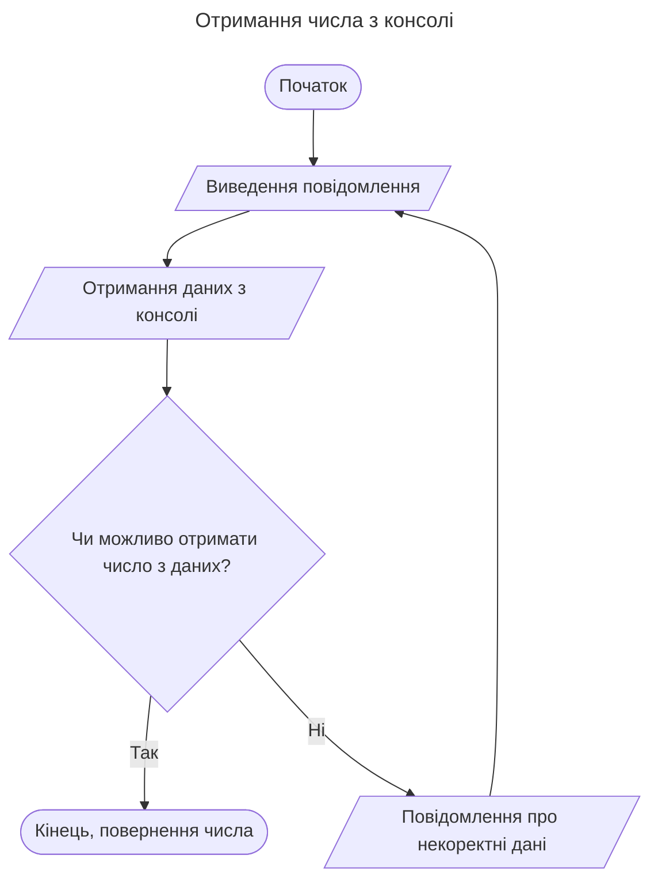
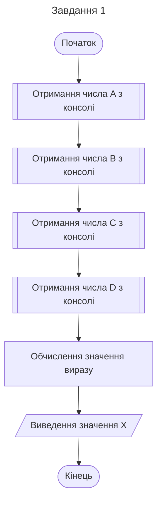
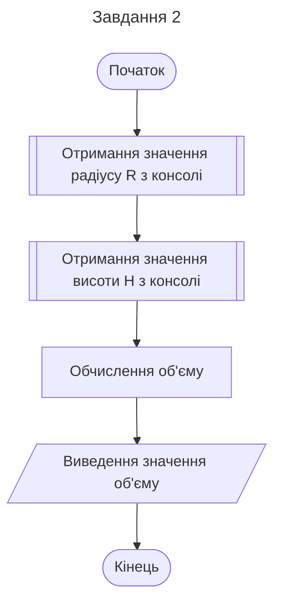
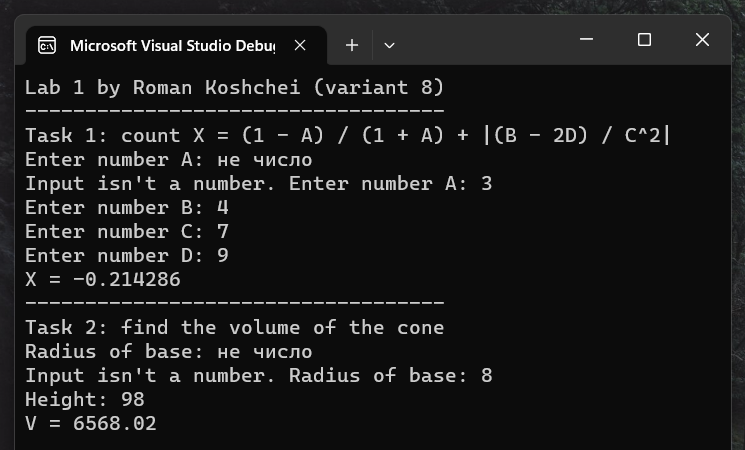
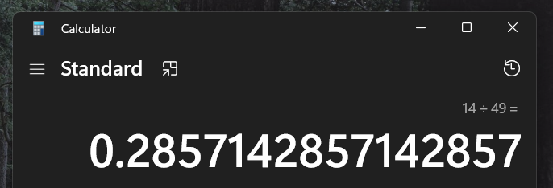
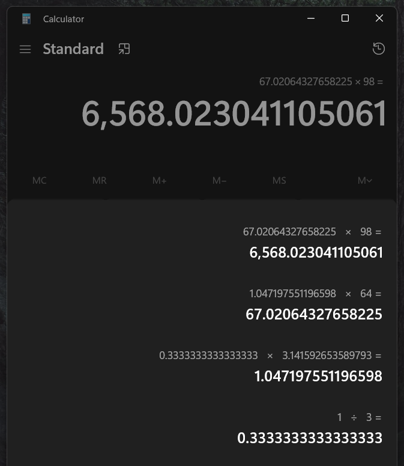

# Лабораторна робота №1

## Мета

- Вивчити особливості використання вбудованих типів даних: char, int, long, short, float, double, unsigned char, unsigned int, unsigned long.
- Вивчити особливості використання функцій введення - виведення.
- Навчитися застосовувати стандартні математичні функції.

## Умова задачі

### Завдання 1

Потрібно обчислити значення виразу: `X = (1 - A) / (1 + A) + |(B - 2D) / C^2|`
та вивести його на екран. Змінні A, B, C, D мають бути введені користувачем через консоль.

### Завдання 2

Мета другого завдання - написати програму для визначення об'єму конуса,
якщо значення радіусу його основи та висоти вводяться користувачем через консоль.

## Аналіз задачі

Обидва завдання вимагають отримання чисел з консолі.
Для цього була створена функція `parse_num`, яка перетворює рядок у число
з обробкою помилок і повертає `optional<float>`, що означає,
що якщо перетворення не вдалося, то повертається `nullopt` - відсутність значення.
Функція `num_from_console` запитує користувача ввести число,
поки введене значення не буде успішно перетворено.

### Завдання 1

Для виконання першого завдання отримуємо з консолі значення змінних A, B, C, D.
Під час обчислень використовуються математичні функції `abs` та `pow`.

### Завдання 2

ля обчислення об'єму конуса отримуємо з консолі значення радіусу основи R і висоти H.
Також для обчислень використовується константа `PI`, яку ми оголосили в початку файла.

### Джерела

Тип `optional`: https://en.cppreference.com/w/cpp/utility/optional

## Блок-схема алгоритму програми







### Джерела

Схеми зроблені за допомогою: [Mermaid Js](https://mermaid.js.org/)

Типи елементів блок схеми: [Wiki](https://uk.wikipedia.org/wiki/%D0%91%D0%BB%D0%BE%D0%BA-%D1%81%D1%85%D0%B5%D0%BC%D0%B0#%D0%9E%D1%81%D0%BD%D0%BE%D0%B2%D0%BD%D1%96_%D0%B5%D0%BB%D0%B5%D0%BC%D0%B5%D0%BD%D1%82%D0%B8_%D1%81%D1%85%D0%B5%D0%BC_%D0%B0%D0%BB%D0%B3%D0%BE%D1%80%D0%B8%D1%82%D0%BC%D1%83)

## Код програми

Можна знайти у файлі [labs.cpp](../labs/labs.cpp)

Для завантаження можна використовувати репозиторій або сам файл.

## Результат виконання програми



## Аналіз достовірності результатів

Під час виконання програма виводить числа в консоль з обмеженням
кількості цифр за замовчуванням.

### Завдання 1

Для тестування першого завдання ми використовуємо такі значення: A = 3, B = 4, C = 7, D = 9.

```
X = (1 - A)/(1 + A) + |(B - 2D) / C^2|
X = (1 - 3) / (1 + 3) + |(4 - 2*9) / 7^2|
X = -2 / 4 + |-14  / 49|
X = -0.5 + 0.2857142857142857
X = -0.2142857142857143
X ~ -0.214286
```



### Завдання 2

Для тестування другого завдання ми використовуємо такі значення: R = 8, H = 98.

```
PI = 3.141592653589793238463

V = (1/3) * PI * R^2 * H
V = (1/3) * PI * 64 * 98
V = 6,568.023041105061
V ~ 6,568.02
```



## Висновки

У ході лабораторної роботи №1 були досягнуті наступні результати:

- Опрацьовані особливості використання вбудованих типів даних та функцій введення-виведення в мові програмування C++.
- Вивчено та успішно використано стандартні математичні функції для обчислення виразів у завданнях.
- Програма була створена та перевірена на коректність роботи, показавши правильні результати для обох завдань.

Можливі напрямки подальшого вдосконалення включають:

- Додавання обробки непередбачуваних помилок та повідомлень для користувача.
- Розширення кількості математичних задач, що може вирішити програма.
- Збереження результатів обчислень у файлі.
