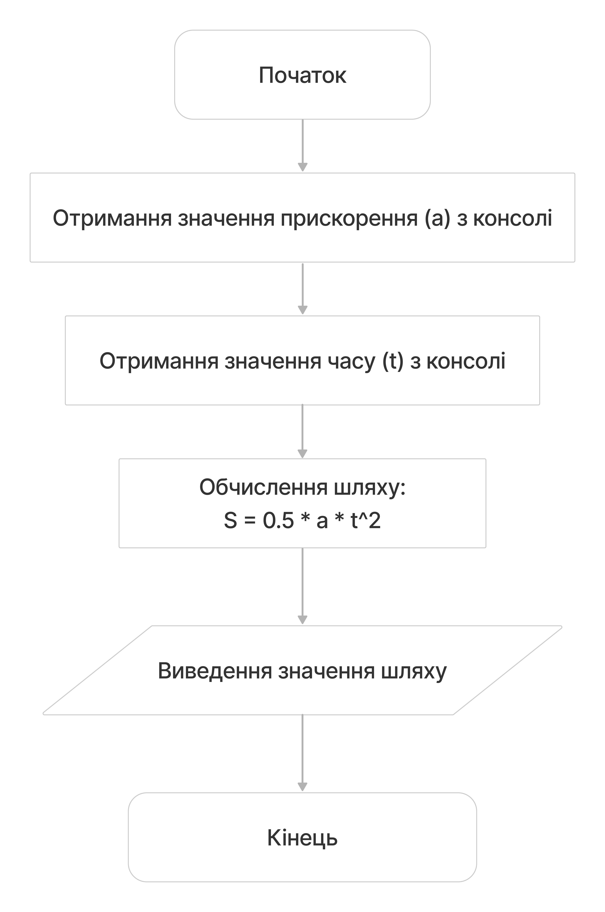
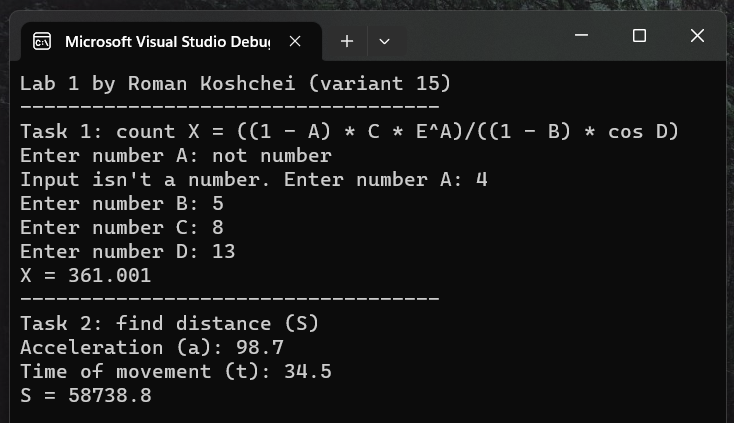

<!-- <script setup>
  import { data } from './1.data.js'
</script>
<div v-html="data"></div> -->

# Лабораторна робота №1

## Мета

- Вивчити особливості використання вбудованих типів даних: char, int, long, short, float, double, unsigned char, unsigned int, unsigned long.
- Вивчити особливості використання функцій введення - виведення.
- Навчитися застосовувати стандартні математичні функції.

## Умова задачі

### Завдання 1

Потрібно обчислити значення виразу: `X = (1 - A) / (1 + A) + |(B - 2D) / C^2|`
та вивести його на екран. Змінні A, B, C, D мають бути введені користувачем через консоль.

### Завдання 2

Мета другого завдання - написати програму для визначення об'єму конуса,
якщо значення радіусу його основи та висоти вводяться користувачем через консоль.

## Аналіз задачі

Обидва завдання вимагають отримання чисел з консолі.
Для цього була створена функція `parse_num`, яка перетворює рядок у число
з обробкою помилок і повертає `optional<float>`, що означає,
що якщо перетворення не вдалося, то повертається `nullopt` - відсутність значення.
Функція `numFromConsole` запитує користувача ввести число,
поки введене значення не буде успішно перетворено.

### Завдання 1

Для виконання першого завдання отримуємо з консолі значення змінних A, B, C, D.
Під час обчислень використовуються математичні функції `abs` та `pow`.

### Завдання 2

ля обчислення об'єму конуса отримуємо з консолі значення радіусу основи R і висоти H.
Також для обчислень використовується константа `PI`, яку ми оголосили в початку файла.

### Джерела

Тип `optional`: https://en.cppreference.com/w/cpp/utility/optional

## Блок-схема алгоритму програми

### Отримання числа з консолі


### Завдання 1


### Завдання 2



## Код програми

<!-- Можна знайти у файлі [labs/lab_1.h](../labs/lab_1.h) -->

Для завантаження можна використовувати репозиторій або
[файл](https://github.com/koshcher/op/blob/main/src/labs/lab1.h)

```cpp
#pragma once

#include <iostream>
#include "shared.h"

namespace lab1 {
    const double PI = 3.141592653589793238463;

    void task1() {
        std::cout
            << "Task 1: count X = (1 - A) / (1 + A) + |(B - 2D) / C^2|"
            << std::endl;

        float a = numFromConsole("Enter number A: ");
        float b = numFromConsole("Enter number B: ");
        float c = numFromConsole("Enter number C: ");
        float d = numFromConsole("Enter number D: ");

        double x = (1.0 - a) / (1.0 + a) + abs((b - 2.0 * d) / pow(c, 2));
        std::cout << "X = " << x << std::endl;
    }

    void task2() {
        std::cout << "Task 2: find the volume of the cone" << std::endl;

        float r = numFromConsole("Radius of base: ");
        float h = numFromConsole("Height: ");

        double v = (1.0 / 3.0) * PI * r * r * h;
        std::cout << "V = " << v << std::endl;
    }

    void run()
    {
        std::cout << "Lab 1 by Roman Koshchei (variant 8)" << std::endl;
        std::cout << "-----------------------------------" << std::endl;
        task1();
        std::cout << "-----------------------------------" << std::endl;
        task2();
    }
}
```

Спільний код:

```cpp
#pragma once

#include <optional>
#include <iostream>
#include <string>

/*
    Functions that can be used across different labs.
*/

// small wrapper to avoid throwing errors
std::optional<double> parseNum(std::string str) {
    try { return std::stod(str); }
    catch (...) { return std::nullopt; }
}

double numFromConsole(std::string message) {
    std::cout << message;
    std::string input;

    // optimistic input without error message
    std::getline(std::cin, input);
    std::optional<double> num = parseNum(input);

    while (!num.has_value())
    {
        std::cout << "Input isn't a number. " << message;
        std::getline(std::cin, input);
        num = parseNum(input);
    }
    return num.value();
}
```

## Результат виконання програми



## Аналіз достовірності результатів

Під час виконання програма виводить числа в консоль з обмеженням
кількості цифр за замовчуванням.

### Завдання 1

Для тестування першого завдання ми використовуємо такі значення: A = 3, B = 4, C = 7, D = 9.

```
X = (1 - A)/(1 + A) + |(B - 2D) / C^2|
X = (1 - 3) / (1 + 3) + |(4 - 2*9) / 7^2|
X = -2 / 4 + |-14  / 49|
X = -0.5 + 0.2857142857142857
X = -0.2142857142857143
X ~ -0.214286
```


### Завдання 2

Для тестування другого завдання ми використовуємо такі значення: R = 8, H = 98.

```
PI = 3.141592653589793238463

V = (1/3) * PI * R^2 * H
V = (1/3) * PI * 64 * 98
V = 6,568.023041105061
V ~ 6,568.02
```


## Висновки

Прогрмана написана успішно та протестована на достовірність.

Можливі напрямки подальшого вдосконалення включають:

- Розширення кількості математичних задач, що може вирішити програма.
- Збереження результатів обчислень у файлі.
