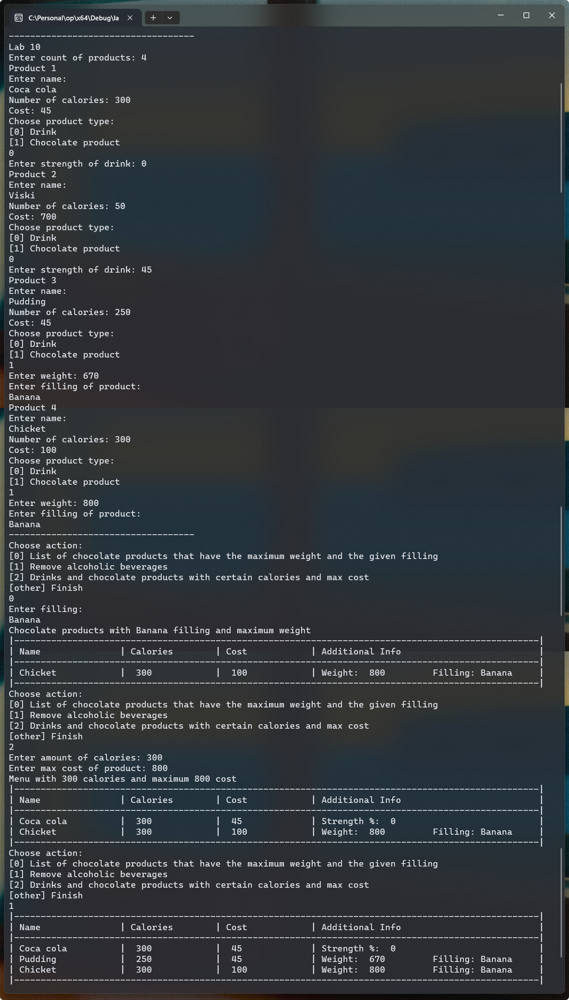

# Лабораторна робота №10

> В процессі виконання

## Мета

- Вивчення основних концепцій та принципів роботи зі структурами у мові програмування
- Оволодіння навичками роботи з масивами структур
- Навчання роботи з об'єднаннями

## Умова задачі

Створити масив структур. Кожна структура складається з таких елементів: напої та шоколадні вироби; їх калорійність, вартість. Для напоїв вказати міцність, для шоколадних виробів - вагу, начинку.

Реалізувати запити:

- визначити список шоколадних виробів, що мають максимальну вагу і задану начинку;
- вилучити з масиву інформацію про алкогольні напої;
- скласти меню з напоїв і шоколадних виробів, що відповідають заданій калорійності та вартості.

Результати запитів вивести у вигляді таблиць

## Аналіз задачі

Загальне меню це список продуктів, коже з яких - або напій, або шоколадний виріб.
І напій, і шоколадний виріб мають поля `назва`, `калорійність`, `вартість`.

Для зберігання унікальних деталей про продутки я створив 2 структури.
У продукті є поле з деталями `details`, що зберігає або деталі про напій, або про
шоколадний виріб.

Поле з деталями має тип `std::variant<DrinkDetails, ChocolateDetails>`. Що
дозволяє зберігати 1 з цих типів у полі.

## Блок-схема алгоритму програми

## Код програми

::: warning
Функції, константи та структури з простору імен `shared`, такі як `shared::Str`,
можна знайти в вкладці [Спільний код](./shared.md) або у файлі [shared.h](https://github.com/koshcher/op/blob/main/src/labs/shared.h)
:::

```cpp
#pragma once

#include "shared.h"
#include <variant>

namespace lab10 {
struct DrinkDetails {
    int strength;
};

struct ChocolateDetails {
    int weight;
    shared::Str filling;
};

struct Product {
    shared::Str name;

    int calories;
    int cost;

    std::variant<DrinkDetails, ChocolateDetails> details;
};

struct Menu {
    std::unique_ptr<Product[]> products;
    int count;
};

Menu makeMenu(const int& count) {
    return Menu { std::make_unique<Product[]>(count), count };
}

DrinkDetails enterDrinkDetails() {
    DrinkDetails details {};
    details.strength = shared::intFromConsole("Enter strength of drink: ");
    while (details.strength < 0 || details.strength > 100) {
        std::cout << "Drink strength is percent of alcohol in it" << std::endl;
        details.strength = shared::intFromConsole("Enter strength of drink (0% - 100%): ");
    }
    return details;
}

ChocolateDetails enterChocolateDetails() {
    ChocolateDetails details;
    details.weight = shared::intFromConsole("Enter weight: ");
    std::cout << "Enter filling of product:" << std::endl;
    details.filling = shared::enterString();
    return details;
}

Menu enterMenu() {
    int count = shared::positiveIntFromConsole("Enter count of products: ");
    Menu menu = makeMenu(count);

    for (int i = 0; i < menu.count; i += 1) {
        std::cout << "Product " << i + 1 << std::endl;
        Product product;

        std::cout << "Enter name:" << std::endl;
        product.name = shared::enterString();

        product.calories = shared::positiveIntFromConsole("Number of calories: ");
        product.cost = shared::positiveIntFromConsole("Cost: ");

        std::cout << "Choose product type:" << std::endl;
        std::cout << "[0] Drink" << std::endl;
        std::cout << "[1] Chocolate product" << std::endl;

        int type = shared::intFromConsole("");
        while (type < 0 || type > 1) {
            type = shared::intFromConsole("Such product type doesn't exsits. Enter product type: ");
        }

        if (type == 0) {
            product.details = enterDrinkDetails();
        }
        else {
            product.details = enterChocolateDetails();
        }

        menu.products[i] = std::move(product);
    }
    std::cout << shared::LINE_SEPARATOR << std::endl;
    return menu;
}

void printProduct(const Product& product) {
    std::cout << "| ";
    shared::printStr(product.name, 20);

    std::cout
        << " | " << shared::fillSpace(product.calories, 15) << " | "
        << shared::fillSpace(product.cost, 15) << " | ";

    shared::match(product.details,
    [](const DrinkDetails& details) {
        std::cout << "Strength %: " << shared::fillSpace(details.strength, 28);
    },
    [](const ChocolateDetails& details) {
        std::cout << "Weight: " << shared::fillSpace(details.weight, 12) << " Filling: ";
        shared::printStr(details.filling, 12);
    });
    std::cout << " |" << std::endl;
}

void printMenuHead() {
    std::cout << "|---------------------------------------------------------------------------------------------------|" << std::endl;
    std::cout << "| Name               | Calories        | Cost            | Additional Info                          |" << std::endl;
    std::cout << "|---------------------------------------------------------------------------------------------------|" << std::endl;
}

void printMenu(const Menu& menu) {
    printMenuHead();
    for (int i = 0; i < menu.count; i += 1) {
        printProduct(menu.products[i]);
    }
    std::cout << "|---------------------------------------------------------------------------------------------------|" << std::endl;
}

int MAX_NON_ALCOHOLIC_STRENGTH = 1;

void removeAlcoholicBeverages(Menu& menu) {
    int nonAlcoholicCount = 0;

    for (int i = 0; i < menu.count; i += 1) {
        const auto& product = menu.products[i];

        if (std::holds_alternative<ChocolateDetails>(product.details)) {
            nonAlcoholicCount += 1;
            continue;
        }

        const auto& drink = std::get<DrinkDetails>(product.details);
        if (drink.strength <= MAX_NON_ALCOHOLIC_STRENGTH) {
            nonAlcoholicCount += 1;
        }
    }

    std::unique_ptr<Product[]> products = std::make_unique<Product[]>(nonAlcoholicCount);
    int nonAlcoholicIndex = 0;

    for (int i = 0; i < menu.count; i += 1) {
        auto& product = menu.products[i];

        if (std::holds_alternative<ChocolateDetails>(product.details)) {
            products[nonAlcoholicIndex] = std::move(product);
            nonAlcoholicIndex += 1;
            continue;
        }

        const auto& drink = std::get<DrinkDetails>(product.details);
        if (drink.strength <= MAX_NON_ALCOHOLIC_STRENGTH) {
            products[nonAlcoholicIndex] = std::move(product);
            nonAlcoholicIndex += 1;
        }
    }

    menu.products = std::move(products);
    menu.count = nonAlcoholicCount;
}

void showChocolateWithMaxWeightAndFilling(const Menu& menu, const shared::Str& filling) {
    if (menu.count == 0) {
        std::cout << "There is no products in menu" << std::endl;
        return;
    }

    int maxWeightWithFilling = -1;
    for (int i = 0; i < menu.count; i += 1) {
        const auto& product = menu.products[i];
        if (std::holds_alternative<DrinkDetails>(product.details)) {
            continue;
        }

        const auto& chocolate = std::get<ChocolateDetails>(product.details);
        if (!shared::areStrEquar(chocolate.filling, filling)) {
            continue;
        }

        if (chocolate.weight > maxWeightWithFilling) {
            maxWeightWithFilling = chocolate.weight;
        }
    }

    if (maxWeightWithFilling < 0) {
        std::cout << "There are not any products with ";
        shared::printStr(filling);
        std::cout << " filling" << std::endl;
        return;
    }

    std::cout << "Chocolate products with ";
    shared::printStr(filling);
    std::cout << " filling and maximum weight" << std::endl;

    printMenuHead();

    for (int i = 0; i < menu.count; i += 1) {
        const auto& product = menu.products[i];
        if (std::holds_alternative<DrinkDetails>(product.details)) {
            continue;
        }

        const auto& chocolate = std::get<ChocolateDetails>(product.details);
        if (!shared::areStrEquar(chocolate.filling, filling)) {
            continue;
        }

        if (chocolate.weight == maxWeightWithFilling) {
            printProduct(product);
        }
    }
    std::cout << "|---------------------------------------------------------------------------------------------------|" << std::endl;
}

void showMenuWithCaloriesAndMaxCost(const Menu& menu, const int& calories, const int& maxCost) {
    std::cout
        << "Menu with " << calories << " calories and maximum "
        << maxCost << " cost" << std::endl;
    printMenuHead();

    for (int i = 0; i < menu.count; i += 1) {
        const auto& product = menu.products[i];

        if (product.calories != calories || product.cost > maxCost) {
            continue;
        }
        printProduct(product);
    }

    std::cout << "|---------------------------------------------------------------------------------------------------|" << std::endl;
}

void run() {
    std::cout << "Lab 10" << std::endl;

    auto menu = enterMenu();

    int action = 0;
    while (action >= 0 && action <= 2) {
        std::cout << "Choose action:" << std::endl;
        std::cout << "[0] List of chocolate products that have the maximum weight and the given filling" << std::endl;
        std::cout << "[1] Remove alcoholic beverages" << std::endl;
        std::cout << "[2] Drinks and chocolate products with certain calories and max cost" << std::endl;
        std::cout << "[other] Finish" << std::endl;

        action = shared::intFromConsole("");

        if (action == 0) {
            std::cout << "Enter filling:" << std::endl;
            const shared::Str filling = shared::enterString();
            showChocolateWithMaxWeightAndFilling(menu, filling);
        }
        else if (action == 1) {
            removeAlcoholicBeverages(menu);
            printMenu(menu);
        }
        else if (action == 2) {
            const int calories = shared::intFromConsole("Enter amount of calories: ");
            const int maxCost = shared::intFromConsole("Enter max cost of product: ");
            showMenuWithCaloriesAndMaxCost(menu, calories, maxCost);
        }
    }

    std::cout << shared::LINE_SEPARATOR << std::endl;
}
}
```

## Результат виконання програми



## Аналіз достовірності результатів

## Висновки

Прогрмана написана успішно та протестована на достовірність.
