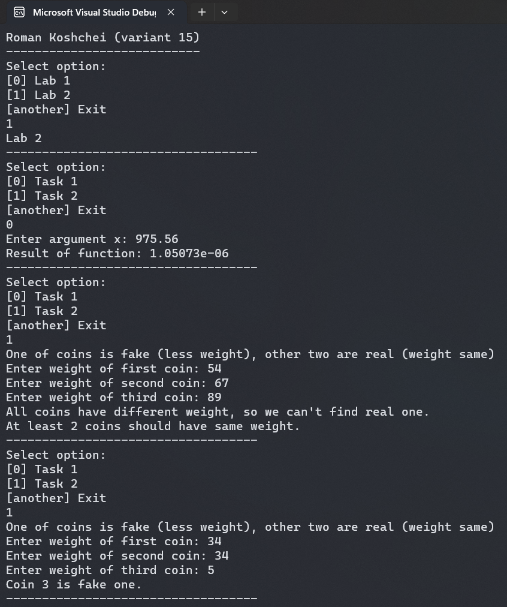
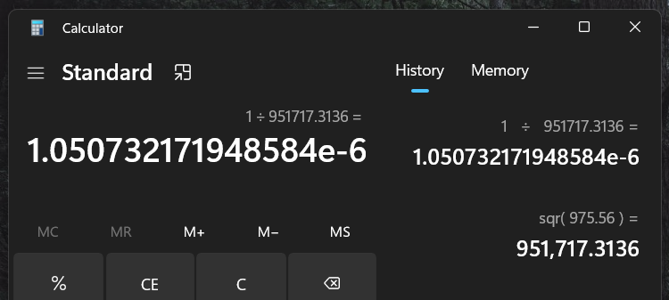

# Лабораторна робота №2

## Мета

- Вивчити особливості розгалужених обчислювальних процесів
- Опанувати технологію використання логічних операторів

## Умова задачі

### Завдання 1

Потрібно обчислити значення виразу:

$$
f(x)=\left\{\begin{array}{c}
1-\sqrt{x^3}, & 0<x<5 \\
1+x^3, & x<0 \\
1 / x^2, & x>5 \\
x, & x=5
\end{array}\right.
$$

та вивести його на екран. Змінна X має бути введенна користувачем через консоль.

### Завдання 2

Мета другого завдання полягає у створенні програми для вирішення наступної задачі:
Серед трьох монет одна з них є фальшивою (вона легша, ніж дві інші, які мають однакову вагу). За допомогою одного зважування на терезах (без використання гир) визначити, яка з монет є фальшивою.

## Аналіз задачі

### Завдання 1

Умова X = 0 не обгрунтова в виразі. Тож будемо вважати,
що при X = 0, немає рішення. Для цього будемо використовувати: `std::optional`.

### Завдання 2

Для представлення зважування на терезах створемо функцію `weighOnScales`,
яку за умовою ми будемо використовувати леше 1 раз. Перед зважуванням нам
потрібно впевнитися, що введена ввага монет є достовірною. Для цього я створив
функцію `validInput`.

## Блок-схема алгоритму програми

### Завдання 1


### Завдання 2


## Код програми

::: warning
Функції та константи з простору імен `shared`, такі як `shared::numFromConsole`,
можна знайти в вкладці [Спільний код](./shared.md) або у файлі [shared.h](https://github.com/koshcher/op/blob/main/src/labs/shared.h)
:::

Для завантаження можна використовувати репозиторій або
[файл](https://github.com/koshcher/op/blob/main/src/labs/lab2.h)

```cpp
#pragma once

#include "shared.h"
#include <optional>
#include <iostream>
#include <math.h>

namespace lab2 {
enum ScalesPosition { Left, Same, Right };
/*
    compare weight of left coin and right coin
    represents operations of weighing on scales
*/
ScalesPosition weighOnScales(const double& coinLeft, const double& coinRight) {
    if (coinLeft == coinRight) return ScalesPosition::Same;
    if (coinLeft > coinRight) return ScalesPosition::Left;
    return ScalesPosition::Right;
}

// validating input
bool validInput(const double& coin1, const double& coin2, const double& coin3) {
    if ((coin1 == coin2 && coin3 > coin1)
        || (coin1 == coin3 && coin2 > coin1)
        || (coin2 == coin3 && coin1 > coin2)
        ) {
        std::cout << "Real coins should weight more than fake one." << std::endl;
        return false;
    }
    if (coin1 != coin2 && coin1 != coin3 && coin2 != coin3) {
        std::cout << "All coins have different weight, so we can't find real one."
            << std::endl
            << "At least 2 coins should have same weight." << std::endl;
        return false;
    }
    if (coin1 == coin2 && coin1 == coin3 && coin2 == coin3) {
        std::cout << "All coins have same weight. "
            << "So we can't differ real and fake ones." << std::endl;
        return false;
    }
    return true;
}

void task2() {
    std::cout
        << "One of coins is fake (less weight), other two are real (weight same)"
        << std::endl;

    const double coin1 = shared::numFromConsole("Enter weight of first coin: ");
    const double coin2 = shared::numFromConsole("Enter weight of second coin: ");
    const double coin3 = shared::numFromConsole("Enter weight of third coin: ");

    if (!validInput(coin1, coin2, coin3)) return;

    // only 1 weigh on scales is allowed by task
    const auto position = weighOnScales(coin1, coin2);
    if (position == ScalesPosition::Left) {
        std::cout << "Coin 2 is fake one." << std::endl;
    }
    else if (position == ScalesPosition::Right) {
        std::cout << "Coin 1 is fake one." << std::endl;
    }
    else {
        std::cout << "Coin 3 is fake one." << std::endl;
    }
}

std::optional<double> f(const double& x) {
    if (x == 0) return std::nullopt;

    if (x == 5) return x;
    if (x > 5) return 1 / pow(x, 2);
    if (x < 0) return 1 + pow(x, 3);
    return 1 - sqrt(pow(x, 3));
}

void task1() {
    const double x = shared::numFromConsole("Enter argument x: ");
    const auto result = f(x);

    if (!result.has_value()) {
        std::cout << "Function doesn't have solution" << std::endl;
        return;
    }

    if (isinf(result.value())) {
        std::cout << "Result of function is infinity" << std::endl;
        return;
    }

    std::cout << "Result of function: " << result.value() << std::endl;
}

void run() {
    std::cout << "Lab 2" << std::endl;
    std::cout << "-----------------------------------" << std::endl;
    shared::select({ { "Task 1", task1 }, { "Task 2", task2 } });
}
}
```

## Результат виконання програми



## Аналіз достовірності результатів

### Завдання 1

Для тестування першого завдання використовуємо таке значення: x = 975.56

За умовою:

$$
f(x)=\left\{\begin{array}{c}
1-\sqrt{x^3}, & 0<x<5 \\
1+x^3, & x<0 \\
1 / x^2, & x>5 \\
x, & x=5
\end{array}\right.
$$

```
x = 975.56
x > 5
f(x) = 1 / x^2
f(x) = 1 / 975.56^2
f(x) = 1 / 951,717.3136
f(x) = 1.050732171948584e-6
f(x) ~ 1.05073e-6
```



### Завдання 2

Для тестування другого завдання спочатку ми спробуємо взяти три різні значення ваги монет та отримаємо повідомлення, що в даній ситуації неможливо визначити фальшиву монету. Потім встановимо наступні значення ваги:

- перша монета: 34
- друга монета: 34
- третя монета: 5

Після зважування перших двох монет ми помічаємо, що їх вага однакова. Отже, фальшивою є третя монета з меншою вагою.

## Висновки

Прогрмана написана успішно та протестована на достовірність.
