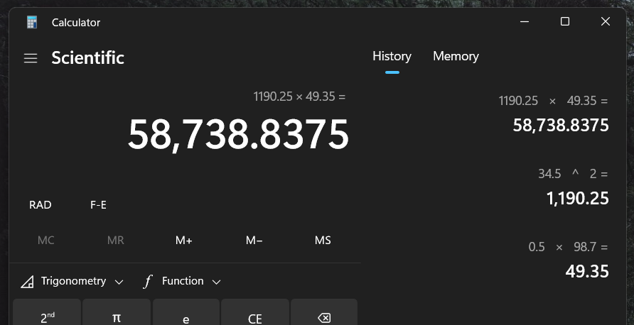

# Лабораторна робота №2

> В процессі виконання

## Мета

- Вивчити особливості розгалужених обчислювальних процесів
- Опанувати технологію використання логічних операторів

## Умова задачі

### Завдання 1

Потрібно обчислити значення виразу:

та вивести його на екран. Змінна X має бути введенна користувачем через консоль.

### Завдання 2

Мета другого завдання полягає у створенні програми для вирішення наступної задачі:
Серед трьох монет одна з них є фальшивою (вона легша, ніж дві інші, які мають однакову вагу). За допомогою одного зважування на терезах (без використання гир) визначити, яка з монет є фальшивою.

## Аналіз задачі

### Завдання 1

Умова першої задачі не є достовірною. Бо умова X = 0 не обгрунтова в виразі,
тож будемо вважати, що 0 включається у першу умову: `0 <= x < 5`.

### Завдання 2

Для представлення зважування на терезах створемо функцію `weighOnScales`,
яку за умовою ми будемо використовувати леше 1 раз. Перед зважуванням нам
потрібно впевнитися, що введена ввага монет є достовірною. Для цього я створив
функцію `validInput`.

## Блок-схема алгоритму програми

### Завдання 1


### Завдання 2


## Код програми

Для завантаження можна використовувати репозиторій або
[файл](https://github.com/koshcher/op/blob/main/src/labs/lab2.h)

```cpp
// lab2.h
#pragma once

#include "shared.h"
#include <iostream>
#include <math.h>

namespace lab2 {
enum ScalesPosition { Left, Same, Right };
/*
    compare weight of left coin and right coin
    represents operations of weighing on scales
*/
ScalesPosition weighOnScales(const double& coinLeft, const double& coinRight) {
    if (coinLeft == coinRight) return ScalesPosition::Same;
    if (coinLeft > coinRight) return ScalesPosition::Left;
    return ScalesPosition::Right;
}

// validating input
bool validInput(const double& coin1, const double& coin2, const double& coin3) {
    if ((coin1 == coin2 && coin3 > coin1)
        || (coin1 == coin3 && coin2 > coin1)
        || (coin2 == coin3 && coin1 > coin2)
        ) {
        std::cout
            << "Real coins should weight more than fake one."
            << std::endl;
        return false;
    }
    if (coin1 != coin2 && coin1 != coin3 && coin2 != coin3) {
        std::cout
            << "All coins have different weight, so we can't find real one."
            << std::endl
            << "At least 2 coins should have same weight." << std::endl;
        return false;
    }
    if (coin1 == coin2 && coin1 == coin3 && coin2 == coin3) {
        std::cout << "All coins have same weight. "
            << "So we can't differ real and fake ones." << std::endl;
        return false;
    }
    return true;
}

void task2() {
    std::cout
        << "One of coins is fake (less weight), other two are real (weight same)"
        << std::endl;

    const double coin1 = numFromConsole("Enter weight of first coin: ");
    const double coin2 = numFromConsole("Enter weight of second coin: ");
    const double coin3 = numFromConsole("Enter weight of third coin: ");

    if (!validInput(coin1, coin2, coin3))
        return;

    // only 1 weigh on scales is allowed by task
    const auto position = weighOnScales(coin1, coin2);
    if (position == ScalesPosition::Left) {
        std::cout << "Coin 2 is fake one." << std::endl;
    }
    else if (position == ScalesPosition::Right) {
        std::cout << "Coin 1 is fake one." << std::endl;
    }
    else {
        std::cout << "Coin 3 is fake one." << std::endl;
    }
}

double fx(const double& x) {
    if (x == 5) return x;
    if (x > 5) return 1 / pow(x, 2);
    if (x < 0) return 1 + pow(x, 3);
    return 1 - sqrt(pow(x, 3));
}

void task1() {
    const double x = numFromConsole("Enter argument x: ");

    std::cout << "Result of function: " << fx(x) << std::endl;
}

void run() {
    std::cout << "Lab 2" << std::endl;
    std::cout << "-----------------------------------" << std::endl;
    select({ { "Task 1", task1 }, { "Task 2", task2 } });
}
}
```

```cpp
// main.cpp

#include "lab1.h"
#include "lab2.h"
#include "shared.h"
#include <iostream>

void main() {
    try {
        std::cout << "Roman Koshchei (variant 15)" << std::endl;
        std::cout << "---------------------------" << std::endl;
        select({ { "Lab 1", lab1::run }, { "Lab 2", lab2::run } });
    }
    catch (...) {
        std::cout << "Unexpected error appeared";
    }
}
```

## Результат виконання програми

<!--  -->

## Аналіз достовірності результатів

<!-- ### Завдання 1

Для тестування першого завдання ми використовуємо такі значення: A = 4, B = 5, C = 8, D = 13.

> Примітка: косинус рахується в радіантах

```
E = 2.71828182845904523536;

X = ((1 - A) * C * E^A) / ((1 - B) * cos D)
X = ((1 - 4) * 8 * E^4) / ((1 - 5) * cos 13)
X = (-24 * 54.5981500331442390) / (-4 * 0.90744678145019621)
Z = -1,310.355600795461736 / -3.62978712580078484
X = 361.000674524784389
X ~ 361.001
```


### Завдання 2

Для тестування другого завдання ми використовуємо такі значення: a = 98.7, t = 34.5.

```
S = 0.5 * a * t^2
S = 0.5 * 98.7 * 34.5^2
S = 49.35 * 1,190.25
S = 58738.8375
S ~ 58738.8
```

 -->

## Висновки

Прогрмана написана успішно та протестована на достовірність.
