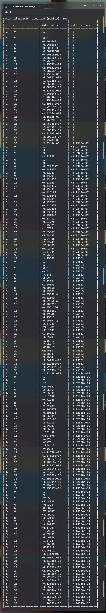
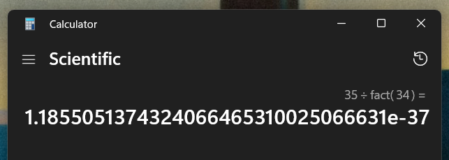

# Лабораторна робота №3

## Мета

- Вивчити особливості циклічних обчислювальних процесів
- Опанувати технологію використання операторів циклів
- Навчитися розробляти алгоритми та програми циклічних процесів

## Умова задачі

Визначити значення:

$$
\sum_{x=1}^5 \sum_{k=0}^{\infty} \frac{(-1)^k(k+1) x^k}{k !}
$$

Користувач задає ліміт для K для обчислення нескінченності. Також, якщо сам вираз стає нескінченністю, ми повинні зупинитися. Кожен раз при зміні однієї з сум потрібно виводити результат у таблиці.

## Аналіз задачі

Задача потребує вичеслення факторіалу. Цієї функції немає в стандартній бібліотеці, тож треба написати свою `factorial`. Функція лінійна, а не рекурсивна, бо так ми уникаємо можливості переповнення стеку пам'яті.

Для виведення красивої тадлибі також створив функцію для заповнення пробілами зайве місце `fillSpace`.

## Блок-схема алгоритму програми


## Код програми

::: warning
Функції та константи з простору імен `shared`, такі як `shared::numFromConsole`,
можна знайти в вкладці [Спільний код](./shared.md) або у файлі [shared.h](https://github.com/koshcher/op/blob/main/src/labs/shared.h)
:::

```cpp
#pragma once

#include <iostream>
#include <sstream>
#include "shared.h"

namespace lab3 {
double fx(const long& k, const int& x, const long& kFactorial) {
    return (pow(-1, k) * (k + 1) * pow(x, k)) / kFactorial;
}

void showState(
    const int& x, const long& k, const double& internalSum, const double& externalSum
) {
    std::cout
        << "| " << x << " | " << shared::fillSpace(k, 15) << " | "
        << shared::fillSpace(internalSum, 15) << " | "
        << shared::fillSpace(externalSum, 15) << " |" << std::endl;
}

void run() {
    std::cout << "Lab 3" << std::endl;
    std::cout << shared::LINE_SEPARATOR << std::endl;

    const double accuracy = shared::numFromConsole(
        "Enter calculation accuracy (number): "
    );

    std::cout
        << "|---|-----------------|-----------------|-----------------|"
        << std::endl;
    std::cout
        << "| x | k               | internal sum    | external sum    |"
        << std::endl;
    std::cout
        << "|---|-----------------|-----------------|-----------------|"
        << std::endl;

    double externalSum = 0;
    for (int x = 1; x <= 5; ++x) {
        double internalSum = 0;

        long factorial = 1;
        long k = 0;
        while (k <= accuracy) {
            const double value = fx(k, x, factorial);
            if (isinf(value)) break;

            const double newInternalSum = internalSum + value;
            if (isinf(newInternalSum)) break;

            internalSum = newInternalSum;
            externalSum += value;
            showState(x, k, internalSum, externalSum);
            k += 1;
            factorial *= k;
        }
    }

    std::cout
        << "|---|-----------------|-----------------|-----------------|"
        << std::endl;
}
}
```

## Результат виконання програми



## Аналіз достовірності результатів

Перевіримо крайні випадки для визначення достовірності: `x=2 k=0`, `x=2 k=1`, `x=1 k=34`.

```
x = 2, k = 0
f(x) = ((-1)^k * (k + 1) * x^k) / k!
f(x) = ((-1)^0 * (0 + 1) * 2^0) / 0!
f(x) = (1 * 1 * 1) / 1
f(x) = 1

internal sum = 1
```

```
x = 2, k = 1
f(x) = ((-1)^k * (k + 1) * x^k) / k!
f(x) = ((-1)^1 * (1 + 1) * 2^1) / 1!
f(x) = (-1 * 2 * 2) / 1
f(x) = -4

internal sum = 1 - 4
internal sum = -3
```

```
x = 1, k = 34
f(x) = ((-1)^k * (k + 1) * x^k) / k!
f(x) = ((-1)^34 * (34 + 1) * 1^34) / 34!
f(x) = (1 * 35 * 1) / 2.95232799 E+38
f(x) = 35 / 2.95232799 E+38
f(x) = 1.18550513743e-37

f(x) настільки маленьке, що не поміщається в double.
Тож ми зупиняємо підрахунок суми.
```



## Висновки

Прогрмана написана успішно та протестована на достовірність.
