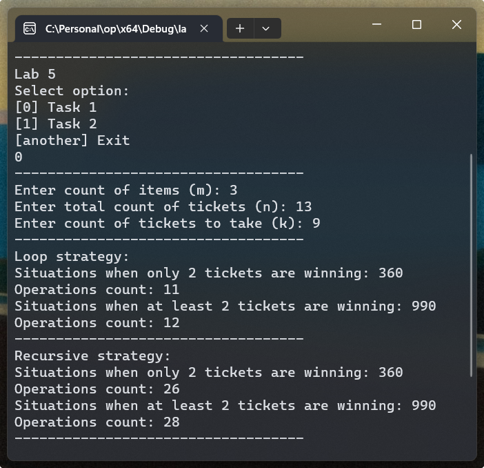

# Лабораторна робота №5

## Мета

- Вивчити особливості рекурсивних процесів
- Опанувати технологію рекурсивних обчислень
- Навчитися розробляти алгоритми та програми із застосуванням рекурсивних функцій

## Умова задачі

### Завдання 1

У речовій лотереї розігруються m предметів з n квитків. Виймається k квитків. Значення m, n та k вводяться з клавіатури. Потрібно знайти кількість способів витягти квитки з урни так, щоб:

- два з них були виграшними;
- принаймні два з них були виграшними.

$$
C_n^k = \frac{n!}{k! (n - k)!}
$$

Потрібно реалізувати рекурсивний і ітеративний варіанти розв'язку. Порівняти ефективність обох варіантів, визначивши глибину рекурсії та кількість ітерацій циклу.

### Завдання 2

Монотонною послідовністю називається послідовність натуральних чисел, в якій кожне натуральне число k зустрічається рівно k раз: 1, 2, 2, 3, 3, 3, 4, 4, 4, 4 ... Увести з клавіатури натуральне число n. Використовуючи рекурсію, вивести перші n членів цієї послідовності. Контрольний тест: введено число 15, отриманий результат: 1 2 2 3 3 3 4 4 4 4 5 5 5 5 5.

## Аналіз задачі

### Завдання 1

Так як нам потрібно створити дві версії - рекурсивну та ітеративну, об'єднаємо
їх під одним інтерфейсом `CountSituationsStrategy`, який буде представляти
функцію, що приймає загальну кількість (n) та кількість елементів, які потрібно
вибрати (k). Це необхідно для вирахування:

$$
C_n^k = \frac{n!}{k! (n - k)!}
$$

Для рекурсивного методу у нас є функція `countSituationsRecursive`,
для ітеративного - `countSituationsLoop`.

Ми також створимо функцію, яка прийматиме функцію для обчислення коефіцієнту C
та виводитиме загальні підрахунки.

### Завдання 2

Основна задача - забезпечити, щоб функція приймала один параметр і була
рекурсивною. Таким чином, ми будемо спускатися до найнижчого рівня, а потім
повертати число та його порядковий номер у виведенні. Якщо порядковий номер
співпадає з числом, то переходимо до наступного числа.

## Блок-схема алгоритму програми

### Завдання 1

Рахування кількості ситуацій та виведення результатів:


Виконання самого завдання (рахування кіл-ті ситуацій з попередньої діаграми):


### Завдання 2

Рекурсивний вивід монотонної послідовності:


Виконання самого завдання:


## Код програми

::: warning
Функції та константи з простору імен `shared`, такі як `shared::numFromConsole`,
можна знайти в вкладці [Спільний код](./shared.md) або у файлі [shared.h](https://github.com/koshcher/op/blob/main/src/labs/shared.h)
:::

```cpp
#include <iostream>
#include "shared.h"

namespace lab5 {
struct CountResult {
    unsigned long operations;
    std::optional<unsigned long long> count;
};

/// <summary>
/// C = total! / (take! * (total - take)!)
/// </summary>
CountResult countSituationsLoop(const long& total, const long& take) {
    unsigned long long totalFactorial = 1;
    unsigned long long takeFactorial = 1;
    unsigned long long totalMinusTakeFactorial = 1;
    const long totalMinusTake = total - take;

    unsigned long iteration = 2;
    for (; iteration <= total; iteration += 1) {
        // Check for overflow of result
        if (totalFactorial > ULLONG_MAX / iteration) return { iteration - 1, std::nullopt };
        totalFactorial *= iteration;

        if (iteration <= take) takeFactorial = totalFactorial;
        if (iteration <= totalMinusTake) totalMinusTakeFactorial = totalFactorial;
    }

    return { iteration - 2,  totalFactorial / (takeFactorial * totalMinusTakeFactorial) };
}

CountResult calculateFactorialRecursively(const long& num) {
    if (num <= 1) return { 1, 1 };

    const auto prev = calculateFactorialRecursively(num - 1);
    if (!prev.count.has_value() || num > ULLONG_MAX / prev.count.value()) {
        return { prev.operations, std::nullopt };
    }

    return { prev.operations + 1, num * prev.count.value() };
}

CountResult countSituationsRecursive(const long& total, const long& take) {
    try {
        unsigned long operations = 0;

        const auto totalFactorial = calculateFactorialRecursively(total);
        operations += totalFactorial.operations;
        if (!totalFactorial.count.has_value()) {
            return { operations, std::nullopt };
        }

        const auto takeFactorial = calculateFactorialRecursively(take);
        operations += takeFactorial.operations;
        if (!takeFactorial.count.has_value()) {
            return { operations, std::nullopt };
        }

        const auto totalMinusTakeFactorial = calculateFactorialRecursively(total - take);
        operations += totalMinusTakeFactorial.operations;
        if (!totalMinusTakeFactorial.count.has_value()) {
            return { operations, std::nullopt };
        }

        const auto& total = totalFactorial.count.value();
        const auto& take = takeFactorial.count.value();
        const auto& totalMinusTake = totalMinusTakeFactorial.count.value();

        return {
            operations,
            total / (take * totalMinusTake)
        };
    }
    catch (...) {
        return { 0, std::nullopt };
    }
}

using CountSituationsStrategy = std::function<CountResult(const long&, const long&)>;

void countSituations(
    const CountSituationsStrategy& strategy,
    const long& countOfItems,
    const long& totalTicketsCount,
    const long& ticketsToTakeCount
) {
    const long winningCount = countOfItems;
    const long loosingCount = totalTicketsCount - countOfItems;

    // only 2 winning
    const auto winningSituations = strategy(winningCount, 2);
    if (!winningSituations.count.has_value()) {
        std::cout << "Number is too big to calculate with standard functionality" << std::endl;
        return;
    }
    const auto& winningSituationsCount = winningSituations.count.value();

    if (loosingCount < ticketsToTakeCount - 2) {
        std::cout << "Can't take only 2 winning" << std::endl;
    }
    else {
        const auto loosingSituations = strategy(loosingCount, ticketsToTakeCount - 2);
        if (!loosingSituations.count.has_value()) {
            std::cout
                << "Number is too big to calculate with standard functionality"
                << std::endl;
            return;
        }

        if (ULLONG_MAX / loosingSituations.count.value() < winningSituationsCount) {
            std::cout
                << "Number is too big to calculate with standard functionality"
                << std::endl;
            return;
        }
        const auto only2Winning = winningSituationsCount * loosingSituations.count.value();
        std::cout
            << "Situations when only 2 tickets are winning: "
            << only2Winning << std::endl;
        std::cout
            << "Operations count: "
            << winningSituations.operations + loosingSituations.operations << std::endl;
    }

    // at least 2 winning
    const auto takingSituations = strategy(totalTicketsCount - 2, ticketsToTakeCount - 2);
    if (!takingSituations.count.has_value()) {
        std::cout << "Number is too big to calculate with standard functionality" << std::endl;
        return;
    }

    if (ULLONG_MAX / takingSituations.count.value() < winningSituationsCount) {
        std::cout << "Number is too big to calculate with standard functionality" << std::endl;
        return;
    }
    const auto atLeast2Winning = winningSituationsCount * takingSituations.count.value();
    std::cout
        << "Situations when at least 2 tickets are winning: "
        << atLeast2Winning << std::endl;
    std::cout
        << "Operations count: "
        << winningSituations.operations + takingSituations.operations << std::endl;
}

void task1() {
    // m = count of winning tickets
    const long mCountOfItems = lround(shared::numFromConsole("Enter count of items (m): "));
    // n >= m
    const long nTotalTicketsCount = lround(
        shared::numFromConsole("Enter total count of tickets (n): ")
    );
    if (nTotalTicketsCount < mCountOfItems) {
        std::cout << "All tickets are winning" << std::endl;
        return;
    }

    const long kTicketsToTakeCount = lround(
        shared::numFromConsole("Enter count of tickets to take (k): ")
    );
    if (kTicketsToTakeCount > nTotalTicketsCount) {
        std::cout << "You can't take more tickets than exist." << std::endl;
    }

    std::cout << shared::LINE_SEPARATOR << std::endl;

    std::cout << "Loop strategy:" << std::endl;
    countSituations(
        countSituationsLoop, mCountOfItems,
        nTotalTicketsCount, kTicketsToTakeCount
    );

    std::cout << shared::LINE_SEPARATOR << std::endl;

    std::cout << "Recursive strategy:" << std::endl;
    countSituations(
        countSituationsRecursive, mCountOfItems,
        nTotalTicketsCount, kTicketsToTakeCount
    );

    std::cout << shared::LINE_SEPARATOR << std::endl;
}

struct ConsistencyItem {
    long num;
    long count;
};

ConsistencyItem showMonotonousConsistency(const long& count) {
    if (count <= 0) return { 1, 1 };

    auto item = showMonotonousConsistency(count - 1);
    if (item.num == item.count) {
        std::cout << item.num << " ";
        return { item.num + 1, 1 };
    }

    std::cout << item.num << " ";
    return { item.num, item.count + 1 };
}

void task2() {
    const long num = lround(shared::numFromConsole("Enter natural number (> 0): "));
    if (num <= 0) {
        std::cout << "Number " << num << " isn't natural." << std::endl;
        return;
    }

    showMonotonousConsistency(num);
    std::cout << std::endl;
}

void run() {
    std::cout << "Lab 5" << std::endl;

    shared::select({ {"Task 1", task1}, {"Task 2", task2} });

    std::cout << shared::LINE_SEPARATOR << std::endl;
}
}
```

## Результат виконання програми

### Завдання 1



### Завдання 2


## Аналіз достовірності результатів

### Завдання 1

Будемо використовувати данні:

- число предметів = 3
- загальне число квитків = 13
- число квитків, що виймається = 9

Для рахування кількості ситуацій, коли лише 2 виграшні:

$$
x = C_{число\ предметів}^{2} * C_{(загальне\ кіл-ть\ квитків\ -\ число\ предметів)}^{(число\ квитків,\ що\ виймається\ -\ 2)}
$$

$$
x = C_3^2 * C_{13 - 3}^{9 - 2} = C_3^2 * C_{10}^7
$$

$$
x = \frac{3!}{2! (3 - 2)!} * \frac{10!}{7! (10 - 7)!}
$$

$$
x = \frac{6}{2} * \frac{3628800}{5040 * 6} = 3 * \frac{3628800}{30240} = 360
$$

Відповідає результатам.

Для рахування кількості ситуацій, коли хоча б 2 виграшні:

$$
x = C_{число\ предметів}^{2} * C_{(загальне\ кіл-ть\ квитків\ -\ 2)}^{(число\ квитків,\ що\ виймається\ -\ 2)}
$$

$$
x = C_3^2 * C_{13 - 2}^{9 - 2} = C_3^2 * C_{11}^7
$$

$$
x = \frac{3!}{2! (3 - 2)!} * \frac{11!}{7! (11 - 7)!}
$$

$$
x = \frac{6}{2} * \frac{39916800}{5040 * 24} = 3 * \frac{39916800}{120960} = 990
$$

Відповідає результатам.

### Завдання 2

У завданні було вказано **контрольний тест**. Якщо введено число 15, то
результат буде: 1 2 2 3 3 3 4 4 4 4 5 5 5 5 5. Що відповідає результатам вище.

## Висновки

Прогрмана написана успішно та протестована на достовірність.

Рекурсивна функція потребує більшу кількість операцій (визовів самої себе) ніж
ітерацій циклу, бо ми рахуємо факторіали окремо один від одного. Рахування
факторіалів разом робить код дуже заплутаним, та має більший шанс помилки.
