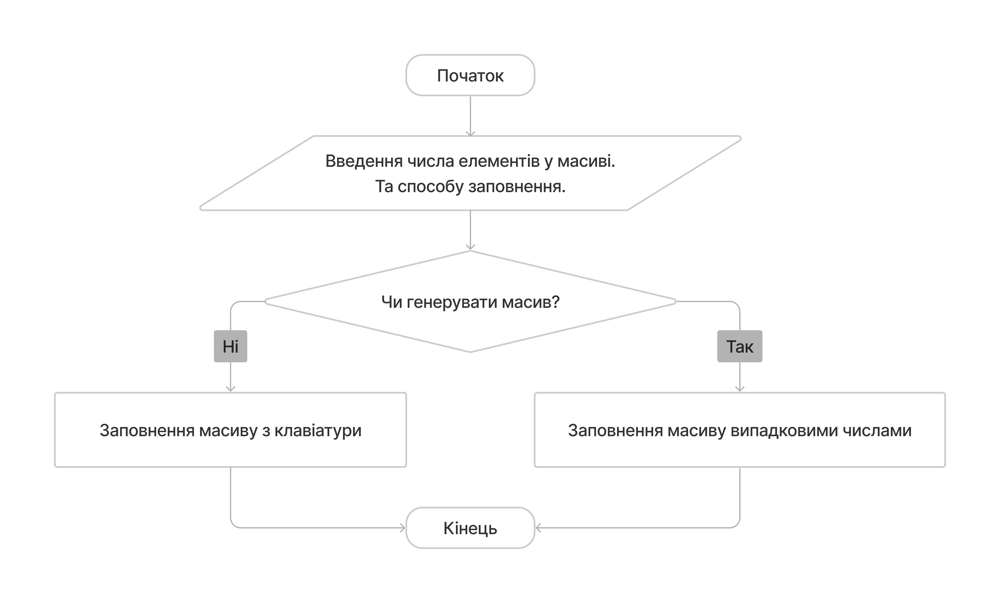
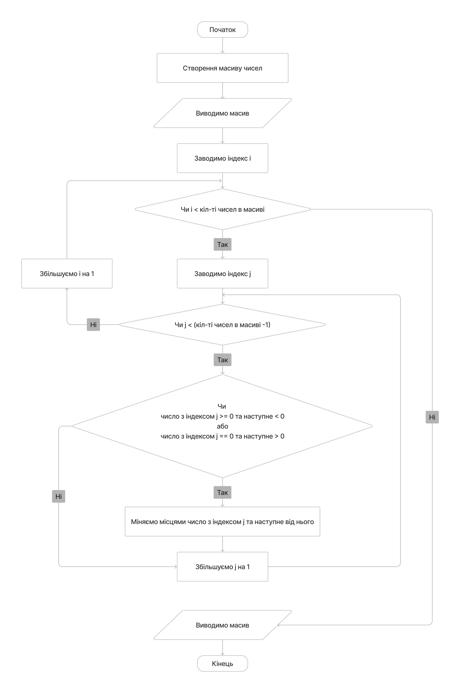
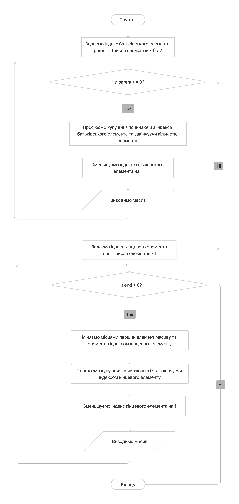
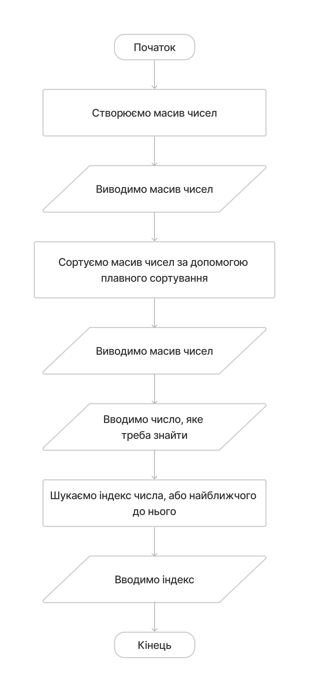
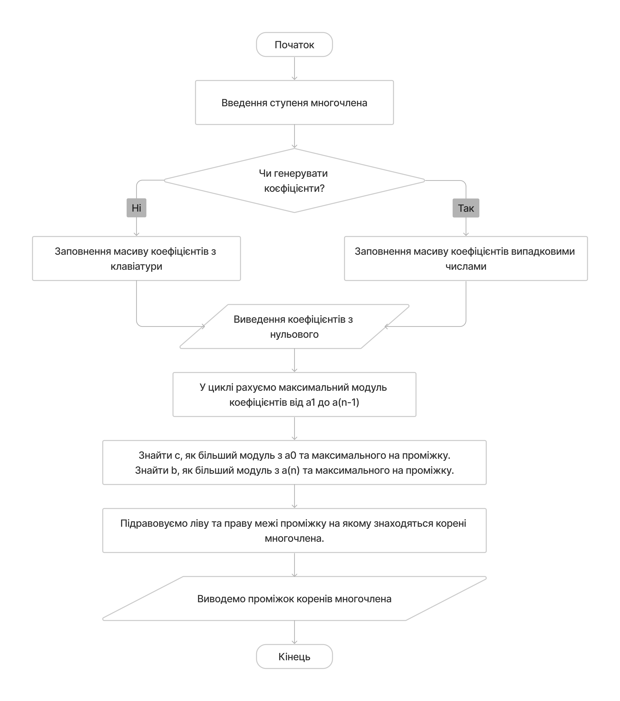
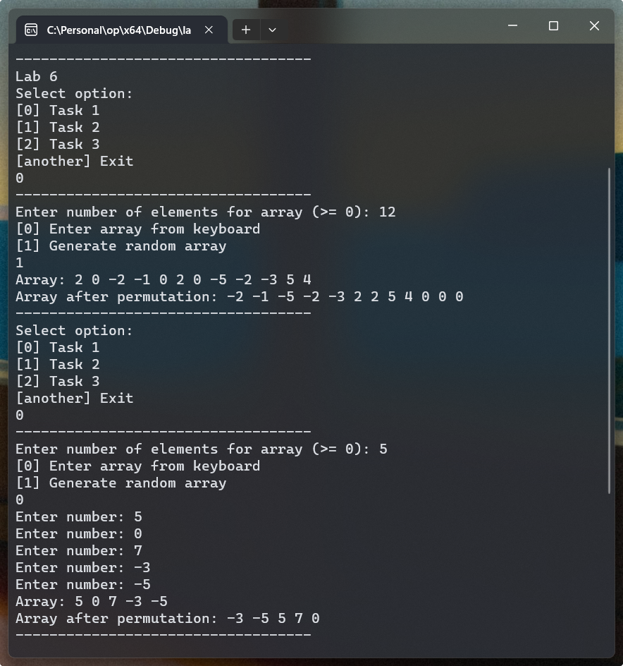
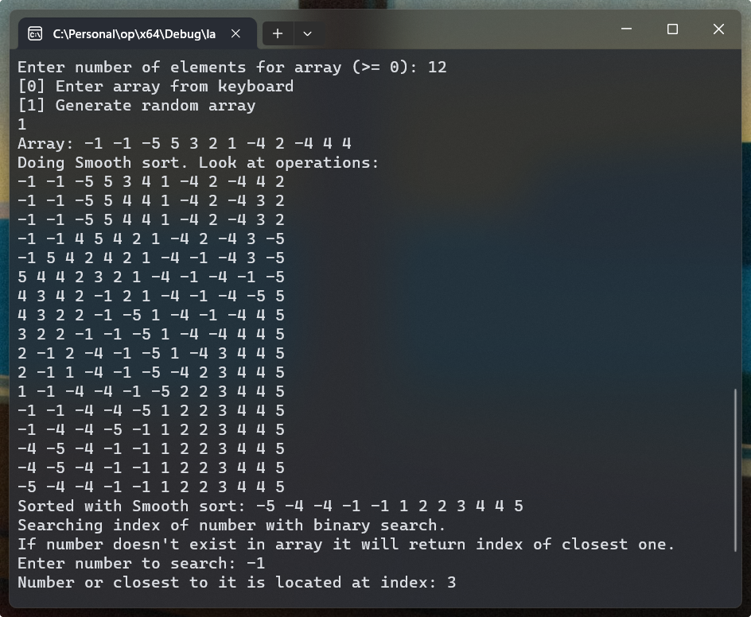
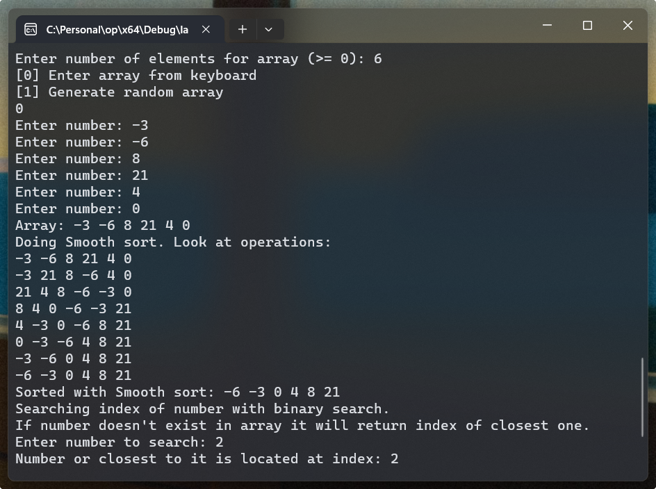
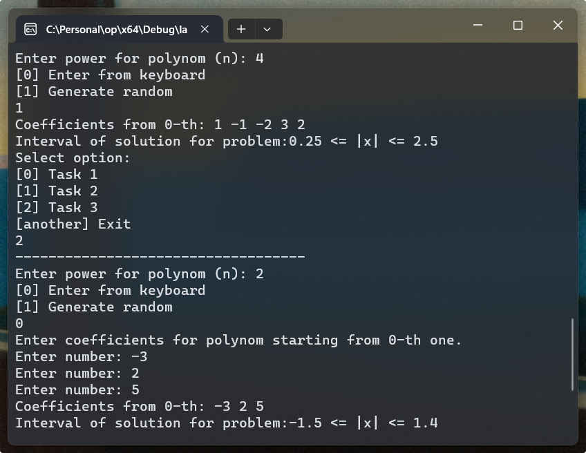

# Лабораторна робота №6

## Мета

- Ознайомитися з особливостями типу масиву
- Опанувати технологію застосування масивів даних
- Навчитися розробляти алгоритми та програми із застосуванням одновимірних масивів

## Умова задачі

### Завдання 1

Створити одновимірний масив цілих чисел (додатних, від'ємних і нульових), кількість елементів якого ввести з клавіатури. Передбачити меню вибору способу створення масиву: введення з клавіатури або генерація псевдовипадкових чисел. Переставити елементи масиву так, щоб спочатку були розташовані всі від’ємні елементи, потім усі додатні елементи, потім усі нульові. Порядок серед додатних і від’ємних елементів має зберегтися. Надрукувати масив після переставлення елементів.

### Завдання 2

Створити одновимірний масив, кількість елементів якого ввести з клавіатури. Передбачити меню вибору способу створення масиву: введення з клавіатури або генерація псевдовипадкових чисел. Відсортувати масив за алгоритмом топологічного сортування (topological sort) та здійснити бінарний пошук з визначенням найближчих вузлів. Передбачити виведення проміжних результатів в процесі виконання ітерацій сортування масиву.

### Завдання 3

Знайти інтервал, на якому розташовані корені многочлена:

$$
P(x)=a_n x^n+a_{n-1} x^{n-1}+a_{n-2} x^{n-2}+\ldots+a_1 x+a_0
$$

користуючись формулою:

$$
\frac{a_0}{\left|b+a_0\right|} \leq|x| \leq \frac{c+\left|a_n\right|}{\left|a_n\right|} \\
$$

$$
c=\max \left(\left|a_0\right|,\left|a_1\right|, \ldots,\left|a_{n-1}\right|\right)
$$

$$
b=\max \left(\left|a_1\right|,\left|a_2\right|, \ldots,\left|a_n\right|\right)
$$

## Аналіз задачі

### Завдання 1

Кількість елементів в масиві задається користувачем, тож нам потрібно
використовувати покажчик (pointer) для динамічного виділення пам'яті для масиву.
Я буду використовувати розумний покажчик (smart pointer): `std::unique_ptr`,
бо він самостійно звільнить пам'ять, виділену під масив, коли вийде за області
дії блоку коду в якому використовується.

Розумні покажчики дозволяють нам керувати пам'ятю безпечним способом, та не
звільняти пам'ять самостійно з `delete`.

### Завдання 2

У завданні пропонується використовувати `Топологічне сортування (Topological sort)`,
але це є помилкою, оскільки Топологічне сортування використовується для сортування
графів, а у нас масив чисел. Тож я використовую алгоритм із наступного
варіанта: `Плавне сортування (Smooth sort)`.

### Завдання 3

Для ефективного використання ресурсів ми можемо рахувати максимальне число від
|a1| до |a(n-1)| лише 1 раз. Потім для `c` порівнювати з `|a0|`, а для `b` з `|an|`.

## Блок-схема алгоритму програми

Створення масиву чисел:



### Завдання 1

Для створення масиву використовується функція з попередньї діаграми.



### Завдання 2

Плавне сортування:


Бінарний пошук:


Завдання:


### Завдання 3



## Код програми

::: warning
Функції та константи з простору імен `shared`, такі як `shared::numFromConsole`,
можна знайти в вкладці [Спільний код](./shared.md) або у файлі [shared.h](https://github.com/koshcher/op/blob/main/src/labs/shared.h)
:::

```cpp
#include "shared.h"

namespace lab6 {
struct NumArray {
    std::unique_ptr<int[]> data;
    int count;
};

NumArray generateNumArray(const int& count) {
    NumArray arr = { std::make_unique<int[]>(count), count };

    for (int i = 0; i < arr.count; i += 1) {
        arr.data[i] = rand() % 11 - 5;
    }
    return arr;
}

NumArray enterFromKeyboardNumArray(const int& count) {
    NumArray arr = { std::make_unique<int[]>(count), count };

    for (int i = 0; i < arr.count; i += 1) {
        long longNumber = lround(shared::numFromConsole("Enter number: "));
        while (longNumber > INT_MAX || longNumber < INT_MIN) {
            std::cout
                << "Number is too large. Maximum allowed number is: " << INT_MAX
                << ". Minimum allowed number is: " << INT_MIN << std::endl;
            longNumber = lround(shared::numFromConsole("Enter number: "));
        }

        arr.data[i] = static_cast<int>(longNumber);
    }
    return arr;
}

void printNumArray(const NumArray& arr) {
    for (int i = 0; i < arr.count; i += 1) {
        std::cout << arr.data[i] << " ";
    }
    std::cout << std::endl;
}

std::optional<NumArray> createNumArray() {
    const long longCount = lround(
        shared::numFromConsole("Enter number of elements for array (>= 0): ")
    );
    if (longCount <= 0) {
        std::cout << "Number of elements can't be less or equal 0" << std::endl;
        return std::nullopt;
    }
    else if (longCount > INT_MAX) {
        std::cout
            << "Number of elements is too large. Maximum allowed number is: "
            << INT_MAX << std::endl;
        return std::nullopt;
    }

    const int count = static_cast<int>(longCount);

    std::cout << "[0] Enter array from keyboard" << std::endl;
    std::cout << "[1] Generate random array" << std::endl;
    const int choice = round(shared::numFromConsole(""));

    if (choice == 0) return enterFromKeyboardNumArray(count);
    if (choice == 1) return generateNumArray(count);

    std::cout << "Option doesn't exist. Retry." << std::endl;
    return std::nullopt;
}

void task1() {
    auto optionalNums = createNumArray();
    if (!optionalNums.has_value()) return;

    auto& nums = optionalNums.value();
    std::cout << "Array: ";
    printNumArray(nums);

    for (int i = 0; i < nums.count; i += 1) {
        for (int j = 0; j < nums.count - 1; j += 1) {
            auto& current = nums.data[j];
            auto& next = nums.data[j + 1];

            if (next < 0 && current >= 0 || next > 0 && current == 0) {
                const int nextCopy = next;
                next = current;
                current = nextCopy;
            }
        }
    }

    std::cout << "Array after permutation: ";
    printNumArray(nums);
    std::cout << shared::LINE_SEPARATOR << std::endl;
}

void swapNumbers(int& a, int& b) {
    int temp = a;
    a = b;
    b = temp;
}

// Function to sift down a heap
void siftDown(const std::unique_ptr<int[]>& arr, const int& start, const int& end) {
    int parent = start;
    int largest = parent;

    while (true) {
        int leftChild = 2 * parent + 1;
        int rightChild = 2 * parent + 2;

        // Find the largest child
        if (leftChild < end && arr[leftChild] > arr[largest]) {
            largest = leftChild;
        }

        if (rightChild < end && arr[rightChild] > arr[largest]) {
            largest = rightChild;
        }

        if (largest == parent) {
            // parent is in correct place, so we stop loop.
            return;
        }

        // Swap the parent and the largest child
        swapNumbers(arr[parent], arr[largest]);
        parent = largest;
    }
}

void smoothSort(const NumArray& arr) {
    // Build a max heap from the array
    for (int parent = (arr.count - 1) / 2; parent >= 0; parent -= 1) {
        // Starting from the middle of the array and moving towards the beginning,
        // we sift down elements to create a max heap structure.
        // A max heap ensures that the largest element is at the root.

        // Use the siftDown function to adjust the elements and maintain the max heap property.
        siftDown(arr.data, parent, arr.count);
        printNumArray(arr);
    }

    // Sort the array by repeatedly moving the max element to the end
    for (int end = arr.count - 1; end > 0; end -= 1) {
        // Swap the current max element (at the root) with the last element
        swapNumbers(arr.data[0], arr.data[end]);

        // Restore the heap property for the remaining elements
        siftDown(arr.data, 0, end);
        printNumArray(arr);
    }
}

int binarySearchWithClosest(const NumArray& arr, int target) {
    int left = 0;
    int right = arr.count - 1;
    int closest = -1;

    while (left <= right) {
        int mid = left + (right - left) / 2;

        if (arr.data[mid] == target) return mid;

        if (arr.data[mid] < target) {
            left = mid + 1;
        }
        else {
            right = mid - 1;
        }

        if (closest == -1 || abs(arr.data[mid] - target) < abs(arr.data[closest] - target)) {
            closest = mid;
        }
    }

    return closest;
}

void task2() {
    auto optionalNums = createNumArray();
    if (!optionalNums.has_value()) return;

    auto& nums = optionalNums.value();
    std::cout << "Array: ";
    printNumArray(nums);

    std::cout << "Doing Smooth sort. Look at operations:" << std::endl;
    smoothSort(nums);
    std::cout << "Sorted with Smooth sort: ";
    printNumArray(nums);

    std::cout
        << "Searching index of number with binary search." << std::endl
        << "If number doesn't exist in array it will return index of closest one."
        << std::endl;
    int search = shared::intFromConsole("Enter number to search: ");
    int index = binarySearchWithClosest(nums, search);
    std::cout << "Number or closest to it is located at index: " << index << std::endl;
}

void task3() {
    int powerN = shared::intFromConsole("Enter power for polynom (n): ");
    if (powerN < 0) powerN *= -1;

    std::cout << "[0] Enter from keyboard" << std::endl;
    std::cout << "[1] Generate random" << std::endl;
    const int choice = round(shared::numFromConsole(""));
    if (choice < 0 || choice > 1) {
        std::cout << "Option doesn't exist. Retry." << std::endl;
        return;
    }

    NumArray arr;

    if (choice == 0) {
        std::cout << "Enter coefficients for polynom starting from 0-th one." << std::endl;
        arr = enterFromKeyboardNumArray(powerN + 1);
    }
    else {
        arr = generateNumArray(powerN + 1);
    }

    std::cout << "Coefficients from 0-th: ";
    printNumArray(arr);

    const int& a0 = arr.data[0];
    const int& aN = arr.data[arr.count - 1];

    int c = a0;
    int b = aN;

    if (arr.count > 1) {
        int maxOnePreLast = arr.data[1];

        for (int i = 2; i < arr.count - 1; i += 1) {
            int num = arr.data[i];
            if (num < 0) num *= -1;

            if (num > maxOnePreLast) {
                maxOnePreLast = num;
            }
        }

        if (maxOnePreLast > c) c = maxOnePreLast;
        if (maxOnePreLast > b) b = maxOnePreLast;
    }

    double left = b + a0;
    if (left < 0) left *= -1;
    left = a0 / left;

    int aNModule = aN < 0 ? -1 * aN : aN;
    double right = (c + aNModule) * 1.0 / aNModule;

    std::cout
        << "Interval of solution for problem:"
        << left << " <= |x| <= " << right << std::endl;
}

void run() {
    srand(time(0));

    std::cout << "Lab 6" << std::endl;

    shared::select({ { "Task 1", task1 }, { "Task 2", task2 }, { "Task 3", task3 } });

    std::cout << shared::LINE_SEPARATOR << std::endl;
}
}
```

## Результат виконання програми

### Завдання 1



### Завдання 2

Геренація масиву та знадходження самого числа, бо воно є в масиві:



Введення масиву з клавіатури та знадходження найближчого числа, бо саме число відсутнє в масиві:



### Завдання 3



## Аналіз достовірності результатів

### Завдання 1

Для тестування ми використовуємо масив:

```
5 0 7 -3 -5
```

Після перестановки ми отримуємо

```
-3 -5 5 7 0
```

Результат співпадає з умовою: спочатку негативні, потім позитивні, потім 0. Та порядок у групі теж зберігається.

### Завдання 2

Всі дії нижче є у результаті винокання.

Генерується масив:

```
-1 -1 -5 5 3 2 1 -4 2 -4 4 4
```

Виконується плавна сортировка та отримуємо в результаті відсортований масив:

```
-5 -4 -4 -1 1 2 2 3 4 4 5
```

Ми шукаємо число `-1` за допомогою бінарного пошуку. Вперше воно трапляється у індексі `3`.

У другому випадку відсортований массив виглядає так:

```
-6 -3 0 4 8 21
```

Ми шукаємо число 2. Його немає в масиві тож ми знаходимо найближче до нього, в цьому випадку це 0, тож індекс `2`.

### Завдання 3

Для 3-го завдання ми використовуємо такі коефіцієнти: a0=-3 a1=2 a2=5. Тож рівняння буде виглядати так:

$$
P(x)= 5x^2 + 2x + -3
$$

Програма видає, що х знаходиться між: `-1.5 <= |x| <= 1.4`

Знайдемо x для перевірки:

$$
\begin{align}
& D = b^2 - 4ac = 4 - 4 * 5 * (-3) = 64 \\

& x_1 = (-b - \sqrt{D}) / 2a = (-2 - 8) / 10 = -1 \\

& x_2 = (-b + \sqrt{D}) / 2a = (-2 + 8) / 10 = 0.6 \\

& x_1 \in [-1.5, 1.4] \\

& x_2 \in [-1.5, 1.4] \\

\end{align}
$$

Як ми бачимо x1 та x2 належать підрахованому проміжку.

## Висновки

Прогрмана написана успішно та протестована на достовірність.
