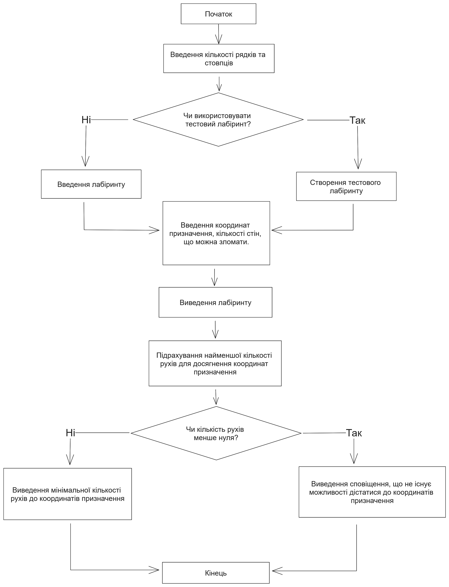

# Лабораторна робота №7

## Мета

- Вивчення особливостей багатовимірних масивів
- Навчання технології роботи з багатовимірними масивами
- Розробка програм та алгоритмів із використанням багатовимірних масивів

## Умова задачі

### Завдання 1

Створити матрицю, кількість рядків m>3 та кількість стовпців n>3 якої ввести з клавіатури.
Передбачити меню вибору способу створення матриці: введення з клавіатури або генерація псевдовипадкових додатніх та від'ємних чисел. Визначити суми елементів кожного рядка та кожного стовпця матриці.
Видалити з матриці рядки та стовпці, сума елементів яких дорівнює нулю. Якщо таких рядків або стовпців немає, то визначити найбільший серед від'ємних елемент та його індекси. Вивести на екран матрицю до та після видалення рядків та стовпців, шуканий елемент та його індекси. Матриці виводити у табличному вигляді.

### Завдання 2

Заданий лабіринт, що є квадратом з N\*N клітин, на межах між деякими клітинами якого побудовані стіни. В кожний момент часу мандрівник може знаходитися в одній і тільки в одній клітині лабіринту. Одним ходом вважається переміщення мандрівника в сусідню по горизонталі чи вертикалі клітину. Мандрівник може проходити крізь стіну К разів. Написати програму, що визначатиме мінімальну кількість ходів, які потрібні мандрівнику, щоб дістатися клітину з координатами (P, Q), що задаються користувачем, починаючи шлях в клітині з координатами (1, 1).

## Аналіз задачі

### Завдання 1

Створимо стуктуру для зберігання матриці `Matrix` та структуру для зберігання сум рядків та стовпців: `NumList`, `Sums`.
Продимося по матріці та порахуємо сумму чисел у кожному стовпці та у кожному рядку, та кількість сум, що дорівнюють 0. Створимо нову меньшу матрицю і заповнимо лише тими рядками и стовпцями, сума яких меньше 0.

### Завдання 2

Для задання лабіринту (його стін) створимо структуру `SquareBoolMatrix`.
Рекурсивно ми будемо проходити в усі сторони з лівого верхнього кута до пункту призначення.
Будемо перевіряти обидва варіанти, якщо не ломаті стіну і якщо ломати.

## Блок-схема алгоритму програми

### Завдання 1


### Завдання 2

Схема рекурсивної функції пошуку шляху


Схема завдання



## Код програми

::: warning
Функції та константи з простору імен `shared`, такі як `shared::numFromConsole`,
можна знайти в вкладці [Спільний код](./shared.md) або у файлі [shared.h](https://github.com/koshcher/op/blob/main/src/labs/shared.h)
:::

```cpp
#include "shared.h"

namespace lab7 {
struct Matrix {
    std::unique_ptr<std::unique_ptr<int[]>[]> data;
    int rowsCount;
    int colsCount;
};

/// <summary>
/// Allocates memory for matrix. For rows and for cols.
/// </summary>
Matrix makeMatrix(const int& rowsCount, const int& colsCount) {
    Matrix matrix = { std::make_unique<std::unique_ptr<int[]>[]>(rowsCount), rowsCount, colsCount };
    for (int i = 0; i < rowsCount; ++i) {
        matrix.data[i] = std::make_unique<int[]>(colsCount);
    }
    return matrix;
}

void printMatrix(const Matrix& matrix) {
    for (int i = 0; i < matrix.rowsCount; ++i) {
        const auto& row = matrix.data[i];
        for (int j = 0; j < matrix.colsCount; ++j) {
            const auto& num = row[j];
            if (num >= 0) std::cout << " ";
            std::cout << num << " ";
        }
        std::cout << std::endl;
    }
}

Matrix enterMatrix(const int& rows, const int& cols) {
    Matrix matrix = makeMatrix(rows, cols);
    for (int i = 0; i < rows; ++i) {
        std::cout << "Enter numbers for row " << i + 1 << ":" << std::endl;
        const auto& row = matrix.data[i];
        for (int j = 0; j < cols; ++j) {
            row[j] = shared::intFromConsole("");
        }
    }
    return matrix;
}

Matrix generateMatrix(const int& rows, const int& cols) {
    Matrix matrix = makeMatrix(rows, cols);
    for (int i = 0; i < rows; ++i) {
        const auto& row = matrix.data[i];
        for (int j = 0; j < cols; ++j) {
            const int num = rand() % 11 - 5;
            row[j] = num == 0 ? 1 : num;
        }
    }
    return matrix;
}

struct NumList {
    std::unique_ptr<int[]> data;
    int count;
};

NumList makeNumList(const int& count) {
    return NumList { std::make_unique<int[]>(count), count };
}

void printNumList(const NumList& list) {
    for (int i = 0; i < list.count; ++i) {
        std::cout << list.data[i] << " ";
    }
    std::cout << std::endl;
}

int moreThan3FromConsole(std::string message) {
    int num = shared::intFromConsole(message);
    while (num < 4) {
        std::cout << "Number must be > 3" << std::endl;
        num = shared::intFromConsole(message);
    }
    return num;
}

struct Sums {
    NumList list;
    int zeroCount;
};

Sums countRowSums(const Matrix& matrix) {
    Sums sums = { makeNumList(matrix.rowsCount),  0 };

    for (int i = 0; i < matrix.rowsCount; ++i) {
        const auto& row = matrix.data[i];

        int sum = 0;
        for (int j = 0; j < matrix.colsCount; ++j) {
            sum += row[j];
        }

        sums.list.data[i] = sum;
        if (sum == 0) sums.zeroCount += 1;
    }
    return sums;
}

Sums countColSums(const Matrix& matrix) {
    Sums sums = { makeNumList(matrix.colsCount), 0 };
    for (int i = 0; i < matrix.colsCount; ++i) sums.list.data[i] = 0;

    const int lastRowIndex = matrix.rowsCount - 1;

    for (int i = 0; i < lastRowIndex; ++i) {
        const auto& row = matrix.data[i];

        for (int j = 0; j < matrix.colsCount; ++j) {
            sums.list.data[j] += row[j];
        }
    }

    const auto& lastRow = matrix.data[lastRowIndex];
    for (int j = 0; j < matrix.colsCount; ++j) {
        int& sum = sums.list.data[j];
        sum += lastRow[j];
        if (sum == 0) {
            sums.zeroCount += 1;
        }
    }

    return sums;
}

Matrix deleteZeroRowColFromMatrix(const Matrix& source, const Sums& rowSums, const Sums& colSums) {
    Matrix newMatrix = makeMatrix(source.rowsCount - rowSums.zeroCount, source.colsCount - colSums.zeroCount);
    int newMatrixI = 0;
    for (int i = 0; i < source.rowsCount; ++i) {
        if (rowSums.list.data[i] == 0) continue;

        const auto& row = source.data[i];
        const auto& newMatrixRow = newMatrix.data[newMatrixI];
        int newMatrixJ = 0;
        for (int j = 0; j < source.colsCount; ++j) {
            if (colSums.list.data[j] == 0) continue;

            newMatrixRow[newMatrixJ] = row[j];
            newMatrixJ += 1;
        }
        newMatrixI += 1;
    }
    return newMatrix;
}

struct LargestNegative {
    int value;
    int row;
    int col;
};

std::optional<LargestNegative> findLargestNegative(const Matrix& matrix) {
    int rowIndex = -1;
    int colIndex = -1;
    std::optional<int> largestNegative = std::nullopt;

    for (int i = 0; i < matrix.rowsCount; ++i) {
        const auto& row = matrix.data[i];

        for (int j = 0; j < matrix.colsCount; ++j) {
            const auto& num = row[j];

            if (num < 0 && (!largestNegative.has_value() || num > largestNegative.value())) {
                largestNegative = num;
                rowIndex = i;
                colIndex = j;
            }
        }
    }

    if (!largestNegative.has_value()) return std::nullopt;
    return LargestNegative { largestNegative.value(), rowIndex, colIndex };
}

void task1() {
    const int rows = moreThan3FromConsole("Enter number of rows: ");
    const int cols = moreThan3FromConsole("Enter number of columns: ");

    std::cout << "[0] Enter matrix from keyboard" << std::endl;
    std::cout << "[1] Generate random matrix" << std::endl;
    const int choice = shared::intFromConsole("");
    if (choice < 0 || choice > 1) {
        std::cout << "Such choice doesn't exist" << std::endl;
        return;
    }

    const Matrix matrix = choice == 0 ? enterMatrix(rows, cols) : generateMatrix(rows, cols);
    printMatrix(matrix);

    // store sums in NumList
    const Sums rowSums = countRowSums(matrix);
    const Sums colSums = countColSums(matrix);

    std::cout << "Sums of rows from first: ";
    printNumList(rowSums.list);

    std::cout << "Sums of cols from first: ";
    printNumList(colSums.list);

    if (rowSums.zeroCount == 0 && colSums.zeroCount == 0) {
        const auto largestNegative = findLargestNegative(matrix);
        if (!largestNegative.has_value()) {
            std::cout << "There are not any negative number in a matrix" << std::endl;
        }
        else {
            std::cout << "Largest negative number: " << largestNegative.value().value << std::endl;
            std::cout
                << "Position row index: " << largestNegative.value().row
                << "  column index: " << largestNegative.value().col << std::endl;
        }
    }
    else {
        std::cout << "Matrix after deleting rows or cols with sum = 0" << std::endl;
        const Matrix newMatrix = deleteZeroRowColFromMatrix(matrix, rowSums, colSums);
        printMatrix(newMatrix);
    }

    std::cout << shared::LINE_SEPARATOR << std::endl;
}

struct BoolMatrix {
    std::unique_ptr<std::unique_ptr<bool[]>[]> data;
    int count;
};

BoolMatrix makeBoolMatrix(const int& count) {
    BoolMatrix walls = BoolMatrix { std::make_unique<std::unique_ptr<bool[]>[]>(count), count };
    for (int i = 0; i < count; i += 1) {
        walls.data[i] = std::make_unique<bool[]>(count);
    }
    return walls;
}

void printLabyrinth(const BoolMatrix& walls, const int& x, const int& y) {
    for (int i = 0; i < walls.count; i += 1) {
        const std::unique_ptr<bool[]>& row = walls.data[i];
        for (int j = 0; j < walls.count; j += 1) {
            const char symbol = i == y && j == x ? 'X' : row[j] ? '#' : '.';
            std::cout << symbol;
        }
        std::cout << std::endl;
    }
}

bool isSafeToWalk(const BoolMatrix& walls, const BoolMatrix& visited, int x, int y) {
    bool inside = x >= 0 && x < walls.count && y >= 0 && y < walls.count;
    return inside && walls.data[y][x] == false && !visited.data[y][x];
}

bool isSafeToBreak(const BoolMatrix& walls, const BoolMatrix& visited, int x, int y) {
    bool inside = x >= 0 && x < walls.count && y >= 0 && y < walls.count;
    return inside && walls.data[y][x] == true && !visited.data[y][x];
}

const int POSSIBLE_MOVES_COUNT = 4;
const std::pair<int, int> POSSIBLE_MOVES[POSSIBLE_MOVES_COUNT] = { {1, 0}, {0, 1}, {-1, 0}, {0, -1} };

void findShortestPath(
    const BoolMatrix& walls, const BoolMatrix& visited,
    int currentX, int currentY, const int& destinationX, const int& destinationY,
    int& minDist, const int& dist, const int& wallsToBreak
) {
    if (currentX == destinationX && currentY == destinationY) {
        minDist = std::min(dist, minDist);
        return;
    }

    // set (i, j) cell as visited
    visited.data[currentY][currentX] = true;

    for (int moveI = 0; moveI < POSSIBLE_MOVES_COUNT; moveI += 1) {
        const auto& move = POSSIBLE_MOVES[moveI];
        const int newX = currentX + move.first;
        const int newY = currentY + move.second;

        if (isSafeToWalk(walls, visited, newX, newY)) {
            findShortestPath(walls, visited, newX, newY, destinationX, destinationY, minDist, dist + 1, wallsToBreak);
        }
    }

    if (wallsToBreak > 0) {
        for (int moveI = 0; moveI < POSSIBLE_MOVES_COUNT; moveI += 1) {
            const auto& move = POSSIBLE_MOVES[moveI];
            const int newX = currentX + move.first;
            const int newY = currentY + move.second;

            if (isSafeToBreak(walls, visited, newX, newY)) {
                findShortestPath(walls, visited, newX, newY, destinationX, destinationY, minDist, dist + 1, wallsToBreak - 1);
            }
        }
    }

    // backtrack: remove (i, j) from the visited matrix
    visited.data[currentY][currentX] = false;
}

// start = (0,0)
int minMoves(
    const BoolMatrix& walls, const int& destinationX,
    const int& destinationY, const int& wallsToBreak
) {
    if (walls.count == 0) return -1;

    BoolMatrix visited = makeBoolMatrix(walls.count);

    int dist = INT_MAX;
    findShortestPath(walls, visited, 0, 0, destinationX, destinationY, dist, 0, wallsToBreak);

    if (dist != INT_MAX) return dist;
    return -1;
}

void task2() {
    /*
        Testing:

        0 0 0 0 0
        0 1 1 1 0
        0 1 0 0 0
        1 1 1 1 1
        1 0 1 1 0

        (4, 3) = With breaking 1 wall minimum is 5.
        (2, 5) = No way with breaking only 1 wall.
    */

    int n = shared::intFromConsole("Enter number of cells (>1): ");
    while (n <= 1) {
        std::cout << "Number of cells must be more than 1." << std::endl;
        n = shared::intFromConsole("Enter number of cells: ");
    }

    std::cout << "Define (P, Q) coordinates for traveler to go to." << std::endl;
    std::cout << "P is column like X, Q is row like Y." << std::endl;
    int p = shared::intFromConsole("Enter P: ");
    while (p < 1) {
        p = shared::intFromConsole("P must be > 0. Enter P: ");
    }
    p -= 1; // make into index

    int q = shared::intFromConsole("Enter Q: ");
    while (q < 1) {
        q = shared::intFromConsole("Q must be > 0. Enter Q: ");
    }
    q -= 1; // make into index

    int k = shared::intFromConsole("Enter number of wall that can be broken (K): ");
    while (k < 0) {
        k = shared::intFromConsole("K must be > 0. Enter K: ");
    }

    BoolMatrix labyrinth = makeBoolMatrix(n);

    std::cout << "Enter labyrinth structure. ";
    std::cout << "Each cell should have one of the next values:" << std::endl;
    std::cout << "[0] - free space" << std::endl;
    std::cout << "[1] - wall" << std::endl;

    for (int i = 0; i < n; i += 1) {
        std::unique_ptr<bool[]>& row = labyrinth.data[i];
        std::cout << "Enter columns of the row " << i + 1 << std::endl;

        for (int j = 0; j < n; j += 1) {
            int wall = shared::intFromConsole("");
            while (wall < 0 || wall > 1) {
                wall = shared::intFromConsole("Value must be 0 or 1. Enter: ");
            }
            row[j] = wall == 1;
        }
    }

    std::cout << "Labyrinth:" << std::endl;
    printLabyrinth(labyrinth, p, q);
    std::cout << "We are reaching: " << labyrinth.data[q][p] << std::endl;

    int min = minMoves(labyrinth, p, q, k);
    if (min < 0) {
        std::cout << "There is no way to reach destination" << std::endl;
    }
    else {
        std::cout << "Minimum count of moves to reach destination is " << min << std::endl;
    }
}

void run() {
    srand(time(0));

    std::cout << "Lab 7" << std::endl;

    shared::select({ { "Task 1", task1 }, { "Task 2", task2 } });

    std::cout << shared::LINE_SEPARATOR << std::endl;
}
}
```

## Результат виконання програми

### Завдання 1


### Завдання 2


## Аналіз достовірності результатів

### Завдання 1

У результаті в перший раз ми згенерували матриці.
Жодна сума чисел рядка стовпців чи чисел стовпця не дорівнює 0.
Тож знаходимо найбільший серед від'ємних це `-1`.
Індекс рядка: `1`, індекс стовпця: `0`.

В другий раз ми вводимо матрицю

```
0 0  0  0
1 0  4  5
3 0 -5 -5
6 0 -7  1
```

Перший рядок й останній мають суму чисел 0, 2-й стовбець також має суму чисел 0.
Тож ми створюємо нову матрицю 2 на 3.

```
1  4  5
3 -5 -5
```

### Завдання 2

В результаті виконнаня на першому зображенні ми використовуємо тестовий лабіринт:

```
0 0 0 0 0
0 1 1 1 0
0 1 0 0 0
1 1 1 1 1
1 0 1 1 0
```

Ми йдемо до координат (4, 3). Це індекс 3, 2.

```
0 0 0 0 0
0 1 1 1 0
0 1 0 X 0
1 1 1 1 1
1 0 1 1 0
```

В перший раз ми можемо зламати 1 стіну, тож нам потрібно лише 5 кроків

```
0
0
0 1 0 X
```

В перший раз ми не можемо зламати жодної стінки, тож нам потрібно 7 кроків

```
0 0 0 0 0
        0
      X 0
```

В останній раз ми вводимо лабіринт:

```
0 1
1 1
```

Йдемо у координати (2, 2). Це індекси 1, 1.

```
0 1
1 X
```

Ми можемо зламати 1 стіну.
Але для дого щоб дійти до координат нам потрібно зламати хоча б 2 стіни.
Тож не існує шляху до координат.

## Висновки

Прогрмана написана успішно та протестована на достовірність.
