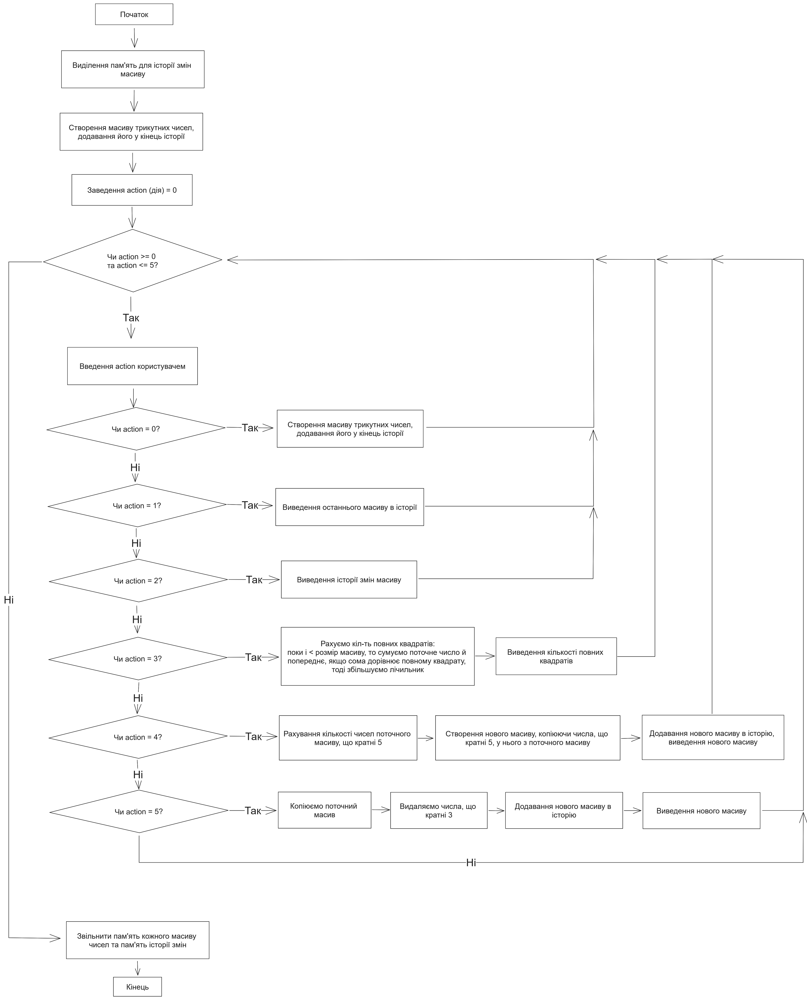
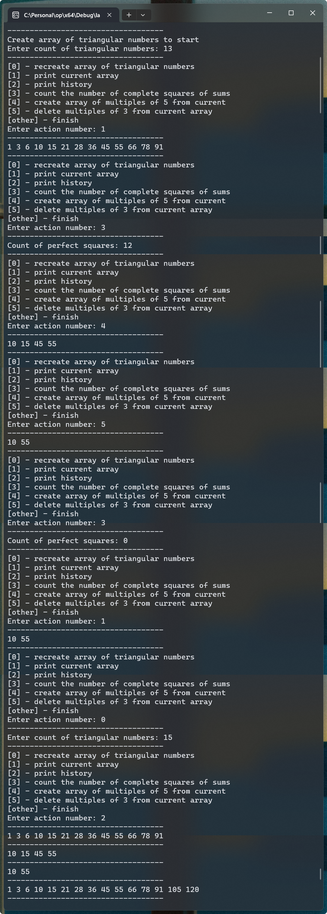

# Лабораторна робота №8

## Мета

- Ознайомитися з особливостями посилальних типів даних
- Опанувати технологію застосування посилальних типів даних
- Навчитися розробляти алгоритми та програми із застосуванням посилальних типів даних

## Умова задачі

Розробити програму, команди меню якої передбачають такі дії:

1. Створити одновимірний масив трикутних чисел, задавши їх кількість з клавіатури. Трикутні числа складають послідовність 1, 3, 6, 10, 15, 21, …. Формула для обчислення трикутного числа: .
2. Вивести створений масив.
3. Виконати такі операції:
   - перевірити, чи дорівнює сума двох послідовних трикутних чисел повному квадрату числа. Підрахувати кількість повних квадратів чисел, що утворює сформований мавив;
   - створити новий масив з елементів вхідного масиву, кратних 5;
   - видалити із вхідного масиву усі елементи, що є кратні 3;
4. Вивести на екран усі перетворення масиву

## Аналіз задачі

Для виріщення задачі розділимо її на частини.

`History` (історія) - це масив усіх масивів чисел (змін масиву),
останій елементі - це масив з яким ми працюємо у данний момент.

`Mutations` (мутації) - це дії, що будуть змінювати або створювати новий масив.
Після кожної матіції новий масив буде додаватися у кінець історії.

`Info` (інформація) - це дії, що будут лише надавати інформацію, що до масивів.

## Блок-схема алгоритму програми



## Код програми

::: warning
Функції та константи з простору імен `shared`, такі як `shared::numFromConsole`,
можна знайти в вкладці [Спільний код](./shared.md) або у файлі [shared.h](https://github.com/koshcher/op/blob/main/src/labs/shared.h)
:::

```cpp
#pragma once

#include "shared.h"

namespace lab8 {
// STRUCTURES

struct NumArray {
    int* data;
    int count;
};

NumArray makeNumArray(const int& count) {
    return NumArray { new int[count], count };
}

NumArray copyNumArray(const NumArray& arr) {
    NumArray newArr = makeNumArray(arr.count);
    for (int i = 0; i < arr.count; ++i) {
        newArr.data[i] = arr.data[i];
    }
    return newArr;
}

void pushToHistory(NumArray*& history, int& count, const NumArray& snapshot) {
    if (history == nullptr) {
        history = new NumArray[1];
        history[0] = snapshot;
        count = 1;
        return;
    }

    NumArray* newHistory = new NumArray[count + 1];
    for (int i = 0; i < count; ++i) {
        newHistory[i] = history[i];
    }
    newHistory[count] = snapshot;

    delete[] history;
    history = newHistory;
    count += 1;
}

NumArray currentArray(const NumArray* const& history, const int& count) {
    return history[count - 1];
}

// MUTATIONS

NumArray triangularNumArray() {
    int count = shared::intFromConsole("Enter count of triangular numbers: ");
    while (count <= 0) {
        count = shared::intFromConsole("Count must be more than 0. Enter count: ");
    }

    NumArray arr = makeNumArray(count);
    arr.data[0] = 1;
    for (int i = 1; i < arr.count; ++i) {
        arr.data[i] = arr.data[i - 1] + i + 1;
    }
    return arr;
}

NumArray multiplesOf5(const int* arr, const int& count) {
    int count5 = 0;
    for (int i = 0; i < count; ++i) {
        if (arr[i] % 5 == 0) {
            count5 += 1;
        }
    }

    NumArray multiples = makeNumArray(count5);
    int multiplesI = 0;

    for (int i = 0; i < count; ++i) {
        const int& num = arr[i];
        if (num % 5 == 0) {
            multiples.data[multiplesI] = num;
            multiplesI += 1;
        }
    }
    return multiples;
}

void deleteMultiplesOf3(int*& arr, int& count) {
    int notMultipleCount = 0;
    for (int i = 0; i < count; ++i) {
        if (arr[i] % 3 != 0) {
            notMultipleCount += 1;
        }
    }

    int* newArr = new int[notMultipleCount];
    int newArrI = 0;
    for (int i = 0; i < count; ++i) {
        const int& num = arr[i];
        if (num % 3 != 0) {
            newArr[newArrI] = num;
            newArrI += 1;
        }
    }

    delete[] arr;
    arr = newArr;
    count = notMultipleCount;
}

// INFO

void printNumArray(int const* const& data, const int& count) {
    for (int i = 0; i < count; ++i) {
        std::cout << data[i] << " ";
    }
    std::cout << std::endl;
}

void printHistory(const NumArray* history, const int& count) {
    for (int i = 0; i < count; ++i) {
        const NumArray& arr = history[i];
        for (int j = 0; j < arr.count; ++j) {
            std::cout << arr.data[j] << " ";
        }

        if (i != count - 1) {
            std::cout << std::endl << shared::LINE_SEPARATOR << std::endl;
        }
        else {
            std::cout << std::endl;
        }
    }
}

int countPerfectSquares(const int* arr, const int& count) {
    int squareCount = 0;

    for (int i = 1; i < count; ++i) {
        const int sum = arr[i] + arr[i - 1];

        for (int j = 1; j <= sum / 2; ++j) {
            if (j * j == sum) {
                squareCount += 1;
            }
        }
    }
    return squareCount;
}

void run() {
    NumArray* history = nullptr;
    int historyCount = 0;

    std::cout << "Create array of triangular numbers to start" << std::endl;
    pushToHistory(history, historyCount, triangularNumArray());
    std::cout << shared::LINE_SEPARATOR << std::endl;

    int action = 0;
    while (action >= 0 && action <= 5) {
        std::cout << "[0] - recreate array of triangular numbers" << std::endl;
        std::cout << "[1] - print current array" << std::endl;
        std::cout << "[2] - print history" << std::endl;
        std::cout << "[3] - count the number of complete squares of sums" << std::endl;
        std::cout << "[4] - create array of multiples of 5 from current" << std::endl;
        std::cout << "[5] - delete multiples of 3 from current array" << std::endl;
        std::cout << "[other] - finish" << std::endl;

        action = shared::intFromConsole("Enter action number: ");
        std::cout << shared::LINE_SEPARATOR << std::endl;

        if (action == 0) {
            pushToHistory(history, historyCount, triangularNumArray());
        }
        else if (action == 1) {
            const auto& arr = currentArray(history, historyCount);
            printNumArray(arr.data, arr.count);
        }
        else if (action == 2) {
            printHistory(history, historyCount);
        }
        else if (action == 3) {
            const auto& arr = currentArray(history, historyCount);
            const int count = countPerfectSquares(arr.data, arr.count);
            std::cout << "Count of perfect squares: " << count << std::endl;
        }
        else if (action == 4) {
            const auto& arr = currentArray(history, historyCount);
            const auto multiples = multiplesOf5(arr.data, arr.count);
            pushToHistory(history, historyCount, multiples);
            printNumArray(multiples.data, multiples.count);
        }
        else if (action == 5) {
            // need to create copy to keep history in a right shape
            NumArray arrCopy = copyNumArray(currentArray(history, historyCount));
            deleteMultiplesOf3(arrCopy.data, arrCopy.count);
            pushToHistory(history, historyCount, arrCopy);
            printNumArray(arrCopy.data, arrCopy.count);
        }

        std::cout << shared::LINE_SEPARATOR << std::endl;
    }

    // free memory
    for (int i = 0; i < historyCount; ++i) {
        delete[] history[i].data;
    }
    delete[] history;
}
}
```

## Результат виконання програми



## Аналіз достовірності результатів

Сопчатку ми генеруємо послідовність трикутних чисел (перші 13):

```
1 3 6 10 15 21 28 36 45 55 66 78 91
```

Вона завжди однакова та її можна знайти в інтернеті.

Потім ми шукаємо кіл-ть сум, що є повними квадратами:

```
1)  1 + 3   = 4   = 2^2
2)  3 + 6   = 9   = 3^2
3)  6 + 10  = 16  = 4^2
4)  10 + 15 = 25  = 5^2
5)  15 + 21 = 36  = 6^2
6)  21 + 28 = 49  = 7^2
7)  28 + 36 = 64  = 8^2
8)  36 + 45 = 81  = 9^2
9)  45 + 55 = 100 = 10^2
10) 55 + 66 = 121 = 11^2
11) 66 + 78 = 144 = 12^2
12) 91 + 78 = 169 = 13^2
```

Загалом отримали 12 сум, що є повними квадратами.
І це співпадає з результатами вище.

Тепер з цього масиву створюємо новий масив з чисел, що кратні 5.
Мають залишитися:

```
10 15 45 55
```

Зпівпадає з результатами вище. Тепер цей масив є поточним.

Наступна дія це видалити числа, що кратні 3 з поточного масиву.
Маємо отримати:

```
10 55
```

Зпівпадає з результатами вище. Тепер цей масив є поточним. Знову шукаємо кіл-ть
повних квадратів:

```
10 + 55 = 65 - не є повним квадратом
```

Кількість повних квадратів дорівнює 0.

Тепер заново створимо масив трикутних чисел (перші 15). І потім виведемо історію
змін масиву. Маємо отримати:

```
1 3 6 10 15 21 28 36 45 55 66 78 91
10 15 45 55
10 55
1 3 6 10 15 21 28 36 45 55 66 78 91 105 120
```

Результат співпадає з перевіркою.

## Висновки

Прогрмана написана успішно та протестована на достовірність.
